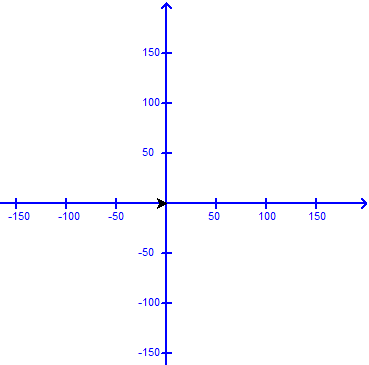
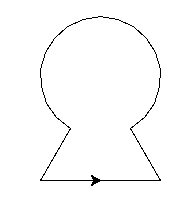

---
title : TP1 Variables et affectations
subtitle: Thème 6 langages de programmation
author : Première NSI,  [Lycée du Parc](https://frederic-junier.org/)
numbersections: true
fontsize: 11pt
geometry:
- top=20mm
- left=20mm
- right=20mm
- heightrounded    
--- 
 
<!-- Définition des hyperliens  -->

[Python]: https://docs.python.org/3/tutorial/datastructures.html
[Python-tutor]: http://pythontutor.com/visualize.html#mode=edit

# Crédits {-} 
 
_Ce cours est inspiré du chapitre 1 du manuel NSI de la collection Tortue chez Ellipse,  auteurs : Ballabonski, Conchon, Filliatre, N'Guyen._

<!-- Définition des hyperliens  -->

# Utiliser le mode interactif

:::methode
Pour installer sur votre machine l'environnement Idle de programmation en [Python][Python], on peut  le télécharger depuis le site officiel <https://www.python.org/downloads/>.

Au lycée dans une session Windows, un raccourci sur le bureau doit permettre de lancer Idle, et dans une session Ubuntu, il suffit d'ouvrir un terminal de commande avec `CTRL + ALT + T`  et de saisir la commande `idle-python3.x`  ou `x`  est le numéro de version de [Python][Python] (la touche de tabulation permet d'obtenir l'autocomplétion après avoir saisi `idle-python3`).
:::

:::exercice

1. Écrire les expressions suivantes avec un  parenthésage  explicite permettant d'indiquer l'ordre de priorité des opérations :

~~~python
>>> 2 - 3 - 4 
-5
>>> 1 / 2 ** 3
0.125
>>> 1/ 2 / 4
0.125
>>> 1/ 2 * 4
2.0
>>> 2 * 3 ** 2
18
>>> 2 ** 3 ** 2
512
>>> 34 // 3 % 4 
3
>>> 5 % 3 ** 4
5
~~~

2. Écrire les expressions suivantes avec le moins de parenthèses possibles :

~~~python
>>> 2 + (8 * (4 - 5))
>>> (3 - 5) - ((6 * 2) / (5 ** 2)) 
~~~
:::

:::exercice

Prédire la valeur affichée dans l'interprète [Python][Python] après les séquences d'instructions suivantes.

1. Séquence 1 :

~~~python
>>> a = 5
>>> a = a + 1
>>> b = a
>>> b = b ** 2 - a
>>> print(b)
~~~

2. Séquence 2 :

~~~python
>>> a = 5
>>> b = 6
>>> a = a - b
>>> b = b + a
>>> a = b - a
>>> print(a, b)
~~~

3. Séquence 3 :

~~~python
>>> from random import randint
>>> a = randint(1, 100)  #entier aléatoire entre 1 et 100
>>> b = randint(1, 100)  #entier aléatoire entre 1 et 100
>>> a = a - b
>>> b = b + a
>>> a = b - a
>>> print(a, b)
~~~
:::

# Premiers programmes et premières erreurs

:::exercice
1. Dans son espace personnel, créer un répertoire `Chapitre1` avec un sous-répertoire `TP1`.
2. Le prix d'une matière première est de 873 euros la tonne au début de l'année. Ce prix subit des variations saisonnières : au premier trimestre il augmente de 347 euros, au second trimestre il augmente de 25 %, au troisième trimestre il subit une baisse de 50 % et enfin il diminue de 100 euros.

  * Créer un nouveau programme avec  l'éditeur d'Idle et l'enregistrer dans `Chapitre1/TP1` sous le nom `prix.py`.

  * Saisir dans ce fichier le code ci-dessous en le complétant afin qu'il calcule les valeurs successives de la variable `prix`. 

~~~python
prix = 873       #prix au début de l'année
prix = ....      #prix à la fin du premier trimestre
prix = ....      #prix à la fin du second trimestre
prix = ....      #prix à la fin du troisième trimestre
prix = ....      #prix à la fin de l'année
print("Prix final :", prix)
~~~
:::

:::exercice
La température $f$ en degrés  Fahrenheit s'obtient à partir de la température $c$ en degrés Celsius par la formule de conversion $f=1,8 * c + 32$. 

On veut écrire un programme qui réponde à la __spécification__ suivante : _convertir une mesure de température de l'échelle  Celsius vers l'échelle Fahrenheit._

1. Dans l'éditeur  d'Idle, créer un programme `temperature.py` et saisir  le code ci-dessous  :

~~~python
f = input("Température en degrés Celsius ? "
d = 1,8 * f + 32
print("La température en degrés Fahrenheit est de ", d)
~~~

2. Exécuter le code, on doit obtenir un message d'erreur indiquant une erreur de Syntaxe. Un curseur indique dans le code la position où l'interpréteur [Python][Python] s'est interrompu dans la lecture du code. Si le curseur est en début de ligne, il faut souvent chercher l'erreur à la fin de la ligne précédente ...

    Corriger l'erreur de syntaxe.

{width=50%}\

3. Exécuter de nouveau le code, on doit obtenir un message d'erreur indiquant que [Python][Python] ne peut réaliser l'opération demandée. On dit que l'interpréteur [Python][Python] a levé une [exception](https://docs.python.org/3.5/tutorial/errors.html).

~~~python
TypeError: can only concatenate str (not "int") to str
~~~

4. Insérer l'instruction `print(type(f))` en ligne 2, exécuter de nouveau. Que représente la valeur affichée avant le message d'erreur ?

5. Remplacer la première instruction par `float(input("Température en degrés Celsius ? "))` puis exécuter. 

    Quel est l'effet de la fonction `float` ? Afficher sa documentation dans l'interpréteur avec l'instruction `help(float)`. 

6. Si on teste le programme pour une température de 45 degrés Celsisus on doit obtenir l'affichage ci-dessous. 

    Est-ce que la spécification du programme est vérifiée ? Corriger le programme.

~~~python
Température en degrés Celsius ? 45
<class 'float'>
La température en degrés Fahrenheit est de  (1, 392.0)
~~~
:::

:::remarque
À propose des différents types d'erreurs possibles en [Python][Python], on pourra lire le premier paragraphe de cette page de la documentation <https://docs.python.org/fr/3.5/tutorial/errors.html>.
:::

# Etat d'un programme, effets de bord

:::exercice

On veut écrire un programme vérifiant la __spécification__ suivant : _le programme doit permuter les valeurs de deux variables `a` et `b` de type entier saisies en entrée_.

Avec l'éditeur Idle, créer dans le répertoire `TP1` un nouveau programme `permutation.py` et recopier le code ci-dessous

~~~python
# entrées
a = int(input('a ?'))
b = int(input('b ?'))
# traitement
a = b
b = a 
# sorties
print("a = ", a, " et b = ", b)
~~~

1. Tester ce programme pour les entrées  605  et 506. La spécification du programme est-elle satisfaite ?
2. Pour représenter l'exécution du programme, compléter le tableau d'état ci-dessous, qui affiche pour chaque ligne d'instruction, les valeurs des variables `a` et `b` et les éventuelles  interactions avec l'utilisateur. 

| Ligne                                                    | Variable a | Variable b | Interactions |
|----------------------------------------------------------|------------|------------|--------------|
| a =  int ( input ( 'a ?' ))                    |       734     |            |    __affichage :__ 'a ?'  __saisie__ : 734          |
| b =  int ( input ( 'b ?' ))                    |   734         |  437          |  __affichage :__ 'b ?'  __saisie :__ 437            |
| a = b                                                    |            |            |              |
| b = a                                                    |            |            |              |
| print ( "a = " , a,  " et b =  " , b) |            |            |              |

1. Proposer une modification du  programme qui permute les valeurs des variables `a` et `b` saisies en entrée.
   
   Démontrer que le programme est correct en complétant un tableau d'état de ce nouveau programme qui utilise des valeurs indéterminées `x` et `y` pour les variables `a` et `b` en entrée. 

2. Proposer une modification du  programme qui permute les valeurs des variables `a` et `b` saisies en entrée, sans utiliser de variable supplémentaire.
:::

# Utiliser une bibliothèque 

:::cours

1. Le coeur du langage [Python][Python] est constitué d'une grammaire, de mots clefs et d'une bibliothèque `built-in` rassemblant des instructions qui sont toujours disponibles : comme `max, print, abs` etc ... Par ailleurs, des __bibliothèques__, appelées __modules__ en [Python][Python], constituent des boîtes outils d'instructions  que le programmeur peut réutiliser en important le module. La distribution standard de [Python][Python] est livrée avec un ensemble de modules constituant sa bibliothèque standard. 

2. Lorsqu'on a besoin d'utiliser une fonction de bibliothèque, on commence par explorer la bibliothèque standard dont les modules sont listés et documentés sur le site officiel <https://www.python.org/>.
Une fois qu'on a déterminé le module qui nous intéresse, par exemple `math`, on dispose de plusieurs façons d'importer des instructions :
  * Si on a besoin juste d'une instruction comme `sqrt`, pour la fonction racine carrée, on peut écrire avant de l'appeler :
~~~python
from math import sqrt
~~~
  * Si on a besoin de plusieurs instructions, mais en nombre limité, comme `sqrt, cos` et `sin`, on peut écrire avant de les appeler :
~~~python
from math import sqrt, cos, sin
~~~
  * Si on a besoin de beaucoup d'instructions du module, on peut utiliser le joker `*` et écrire avant de les appeler :
  ~~~python
  from math import *
  ~~~

  Cette méthode peut sembler pratique mais elle est dangereuse si on importe plusieurs modules, qui contiennent des instructions avec les mêmes noms. Pour cloisonner les espaces de nommage, on préférera la méthode suivante.

  * Une autre méthode consiste à importer juste le module, puis on peut accéder à chacune des instructions ou constantes qu'il contient en les préfixant du nom du module en notation pointée :
~~~python
import math
racine3 = math.sqrt(3)
~~~
  Cette méthode alourdit la syntaxe mais permet un meilleur cloisonnement des noms utilisés par les différents modules utilisés dans un même programme.

:::

:::center
{width=25%}\
:::

:::methode 
 Le module graphique `turtle` permet de piloter un «crayon» afin de tracer dynamiquement des figures géométriques.

Les dessins sont réalisés dans un repère orthonormé virtuel centré sur la fenêtre d'affichage. L'unité des axes est le pixel. Le repère n'est pas visible à l'écran.

La forme par défaut du crayon de tracé est une flèche «orientée», placé au départ à l'origine du repère. Le crayon est situé à la pointe, la flèche montre le sens du tracé en cours ou à venir.

La liste complète des fonctions disponibles grâce au module turtle est disponible sur la [documentation officielle](http://www.frederic-junier.org/PythonSeconde/Python_Seconde_Parc/tortue/doc/turtleDoc.html).
On pourra aussi télécharger un petit résumé au format .pdf en [cliquant ici](http://www.frederic-junier.org/PythonSeconde/Python_Seconde_Parc/fichiers_python_2nde/Resume_Turtle.pdf).

On donne ci-dessous un exemple de programme permettant de tracer un carré de côté 100 pixels.

~~~python
# Carré programme 1
from turtle import *
up()       #lever le crayon
goto(0,0)
down()     #poser le crayon
goto(100, 0)
goto(100, 100)
goto(0,100)
goto(0,0)
exitonclick()  #permet de fermer la fenêtre de tracé proprement
~~~

:::
 
:::exercice

1. Avec l'éditeur d'Idle, créer dans le répertoire `TP1` un nouveau programme `tortue-polygones.py` et importer toutes les fonctions du module `turtle` avec `from turtle import *`.
2. Écrire un programme qui trace un carré de côté 100 pixels en utilisant  les instructions `forward`  et `left`.
3. Écrire un programme qui trace un triangle équilatéral de côté 100 pixels.
4. Écrire un programme qui trace un hexagone régulier de côté 100 pixels.
:::

:::exercice

1. Avec l'éditeur d'Idle, créer dans le répertoire `TP1` un nouveau programme `tortue-clef.py` et importer toutes les fonctions du module `turtle` avec `from turtle import *`.
2. Exécuter puis dans le du mode interactif la documentation de l'instruction `circle` avec `help(circle)`.
3. Saisir dans le programme la séquence d'instructions suivante, exécuter puis observer.

~~~python
from turtle import *
forward(60)
left(120)
forward(60)
right(90)
circle(60,150)
exitonclick() 
~~~ 

1. Compléter le programme pour afficher la figure de gauche.
:::

:::{.minipage width="0.5\linewidth" center="true"}
{width=40%}\
&
{width=40%}\
:::

:::exercice
1. Avec l'éditeur d'Idle, créer dans le répertoire `TP1` un nouveau programme `tortue-triangles.py`.
2. Le programme ci-dessous permet de tracer un triangle équilatéral noir de côté 100 pixels. Compléter le code pour tracer la figure de droite avec la pyramide de triangles.

~~~python
begin_fill()
fillcolor("black")
forward(100)
left(120)
forward(100)
left(120)
forward(100)
left(120)
end_fill()
~~~
:::

:::exercice
1. Avec l'éditeur d'Idle, créer dans le répertoire `TP1` un nouveau programme `tortue-drapeau.py`.
2. Écrire un programme qui dessine le drapeau français.
:::
