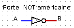
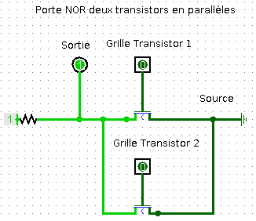
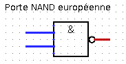
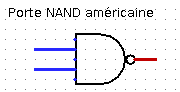
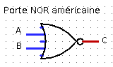
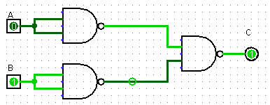
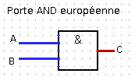
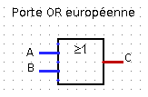
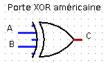

- [Crédits](#crédits)
- [Préambule](#préambule)
- [Portes logiques](#portes-logiques)
  - [Le transistor porte logique de base](#le-transistor-porte-logique-de-base)
  - [D’autres portes logiques](#dautres-portes-logiques)
    - [Transistors en série ou en parallèle](#transistors-en-série-ou-en-parallèle)
    - [Portes logiques et fonctions logiques élémentaires](#portes-logiques-et-fonctions-logiques-élémentaires)
- [Fonctions booléennes](#fonctions-booléennes)
  - [Fonctions booléennes](#fonctions-booléennes-1)
  - [QCM types E3C](#qcm-types-e3c)
  - [Pour aller plus loin (hors programme de première NSI)](#pour-aller-plus-loin-hors-programme-de-première-nsi)
    - [Dresser la table de vérité d’une fonction booléenne](#dresser-la-table-de-vérité-dune-fonction-booléenne)
    - [Exprimer une fonction booléenne à partir de sa table de vérité](#exprimer-une-fonction-booléenne-à-partir-de-sa-table-de-vérité)
- [Circuits combinatoires](#circuits-combinatoires)
  - [Définition](#définition)
  - [Décodeur avec 2 bits d’entrées](#décodeur-avec-2-bits-dentrées)
  - [Demi-additionneur et additionneur 1 bit](#demi-additionneur-et-additionneur-1-bit)
- [Opérations bit à bit en `Python` (hors programme de première NSI)](#opérations-bit-à-bit-en-python-hors-programme-de-première-nsi)
      base](#le-transistor-porte-logique-de-base)
    - [D’autres portes logiques](#dautres-portes-logiques)
        - [Transistors en série ou en
          parallèle](#transistors-en-série-ou-en-parallèle)
        - [Portes logiques et fonctions logiques
          élémentaires](#portes-logiques-et-fonctions-logiques-élémentaires)
- [Fonctions booléennes](#fonctions-booléennes)
    - [Fonctions booléennes](#fonctions-booléennes-1)
    - [QCM types E3C](#qcm-types-e3c)
    - [Pour aller plus loin (hors programme de première
      NSI)](#pour-aller-plus-loin-hors-programme-de-première-nsi)
        - [Dresser la table de vérité d’une fonction
          booléenne](#dresser-la-table-de-vérité-dune-fonction-booléenne)
        - [Exprimer une fonction booléenne à partir de sa table de
          vérité](#exprimer-une-fonction-booléenne-à-partir-de-sa-table-de-vérité)
- [Circuits combinatoires](#circuits-combinatoires)
    - [Définition](#définition)
    - [Décodeur avec 2 bits d’entrées](#décodeur-avec-2-bits-dentrées)
    - [Demi-additionneur et additionneur 1
      bit](#demi-additionneur-et-additionneur-1-bit)
- [Opérations bit à bit en `Python` (hors programme de première
  NSI)](#opérations-bit-à-bit-en-python-hors-programme-de-première-nsi)

# Crédits

*Ce cours est largement inspiré du chapitre 22 du manuel NSI de la
collection Tortue chez Ellipsen auteurs : Ballabonski, Conchon,
Filliatre, N’Guyen.*

# Préambule

Les circuits d’un ordinateur manipulent uniquement des 0 ou des 1
représentés en interne par des tensions hautes ou basses. Les premiers
ordinateurs construits dans la période 1945-1950 sont basés sur une
technologie de tube à vide ou tube électrique. En 1947, aux laboratoires
Bell, [Shockley, Bardeen et
Brattain](https://fr.wikipedia.org/wiki/Transistor) inventent le
**transistor** au *germanium* un petit composant électronique qui se
comporte comme un interrupteur. Les transistors, plus petits et
dissipant moins de chaleur, vont supplanter les tubes électriques : en
1954 le *germanium* est remplacé par le *silicium*, en 1955 apparaissent
les premiers ordinateurs entièrement transistorisés, en 1960 le
transistor à effet de champ permet l’intégration de dizaines composants
dans un centimètre carré. Les transistors sont ensuite directement
gravés dans une plaque de *silicium* constituant un **cicrcuit
intégré**. En 1965 Gordon Moore futur directeur d’Intel énonce la [loi
empirique](https://fr.wikipedia.org/wiki/Loi_de_Moore) portant son nom
qui fixe une feuille de route à l’industrie des mircroprocesseurs : le
doublement de la densité d’intégration des transistors tous les deux
ans. Cette loi s’est vérifiée jusqu’à présent avec une finesse de
gravure d’environ 5 nanomètres en 2020. Le
[graphique](https://en.wikipedia.org/wiki/Moore%27s_law#/media/File:Moore's_Law_Transistor_Count_1971-2018.png)
ci-dessous représente l’évolution du nombre de transistors par circuit
intégré.

  

# Portes logiques

## Le transistor porte logique de base

**Définition 1**

Un **transistor** possède trois broches : la grille, la sortie (ou
drain) et la source soumis à des états de tension haute ou basse qu’on
peut assimiler aux valeurs binaires 1 et 0 d’un **bit**. Si la tension
appliquée sur la grille est haute (bit à 1) alors le transitor laisse
passer le courant entre la source d’énergie et la sortie et cette
dernière passe à l’état de tension basse (bit à 0), sinon la sortie
reste en tension haute (bit 1).

Une **fonction logique** prend un ou plusieurs bits en entrée et
retourne un ou plusieurs bits en sortie. Une **porte logique** est un
circuit électronique représentant une **fonction logique**.

Une **table logique** représente les sorties produites par une fonction
logique pour toutes les entrées possibles.

Un transistor représente une fonction logique dont le bit d’entrée est
l’état de tension de la grille et le bit de sortie, l’état de tension
de la sortie. La **table logique** (table 1) associée est celle du **NON
logique** ou **Inverseur**.

Fichier de test [Logisim](http://www.cburch.com/logisim/) :
[transistor.circ](circuits_logisim/transistor.circ).

  

| A | B = NON(A) |
| :-: | ---------- |
| 0 | 1          |
| 1 | 0          |

**Table logique d’une porte NON**

**Il existe deux conventions de représentation symbolique des portes
logiques, une européenne et une américaine.**

  
&   

[Tutoriel video Logisim : le
transistor](videos/transistor-definition1.mp4)

## D’autres portes logiques

### Transistors en série ou en parallèle

**Exercice 1**

On donne ci-dessous les représentations de deux portes logiques :

  - La **porte NAND** constituée de deux transistors en série
  - La **porte NOR** constituée de deux transistors en parallèle

Chacune de ces portes logiques comportent deux bits d’entrée : A pour la
grille du transistor 1 et B pour la grille du transistor 2 et un bit de
sortie.

Compléter leurs tables logiques.

Vérifier avec [Logisim](http://www.cburch.com/logisim/) et les fichiers
[porte\_NAND.circ](circuits_logisim/porte_NAND.circ) et
[porte\_NOR.circ](circuits_logisim/porte_NOR.circ).

[Tutoriel video Logisim : porte NAND](videos/porteNAND.mp4)

[Tutoriel video Logisim : porte NOR](videos/porteNOR.mp4)

| A | B | NAND(A, B) |
| :-: | - | ---------- |
| 0 | 0 |            |
| 0 | 1 |            |
| 1 | 0 |            |
| 1 | 1 |            |

| A | B | NOR(A, B) |
| :-: | - | --------- |
| 0 | 0 |           |
| 0 | 1 |           |
| 1 | 0 |           |
| 1 | 1 |           |

  
&   

**Voici les représentations symboliques des portes logiques NAND et NOR
:**

  
&   

  
&   

### Portes logiques et fonctions logiques élémentaires

**Exercice 2**

Fichier de test [Logisim](http://www.cburch.com/logisim/) :
[exercice2.circ](circuits_logisim/exercice2.circ).

1.  Compléter la table logique de la porte logique représentée par le
    circuit ci-dessous. Quelle porte logique peut-on ainsi représenter ?

  

| A | B = f(A) |
| :-: | -------- |
| 0 |          |
| 1 |          |

2.  Compléter la table logique de la porte logique représentée par le
    circuit ci-dessous. Quelle fonction logique correspond à cette porte
    logique ?

  

| A | B | C = g(A, B) |
| :-: | - | ----------- |
| 0 | 0 |             |
| 0 | 1 |             |
| 1 | 0 |             |
| 1 | 1 |             |

[Tutoriel video Logisim : exercice 2](videos/exercice2.mp4)

**Exercice 3**

Fichier de test [Logisim](http://www.cburch.com/logisim/) :
[exercice3.circ](circuits_logisim/exercice3.circ).

1.  Compléter la table logique de la porte logique représentée par le
    circuit ci-dessous. Quelle porte logique peut-on ainsi représenter ?

  

| A | B = f(A) |
| :-: | -------- |
| 0 |          |
| 1 |          |

2.  Compléter la table logique de la porte logique représentée par le
    circuit ci-dessous. Quelle fonction logique correspond à cette porte
    logique ?

  

| A | B | C = g(A, B) |
| :-: | - | ----------- |
| 0 | 0 |             |
| 0 | 1 |             |
| 1 | 0 |             |
| 1 | 1 |             |

[Tutoriel video Logisim : exercice 3](videos/exercice3.mp4)

**Voici les représentations symboliques des portes logiques `AND` et
`OR` :**

  
&   

  
&   

**Exercice 4**

1.  Construire un circuit représentant une porte `OR` uniquement avec
    des portes `NOR`.
2.  Construire un circuit représentant une porte `AND` uniquement avec
    des portes `NAND`.

Ainsi chacune des portes, `NAND` ou `NOR` permet de construire les
portes `NOT`, `OR`, `AND`. Toute porte logique pouvant s’exprimer à
l’aide de ces trois portes, les portes `NAND` et `NOR` sont dites
*universelles*.

[Tutoriel video Logisim : exercice 4](videos/exercice4.mp4)

# Fonctions booléennes

## Fonctions booléennes

**Définition 2**

  - Un **booléen** est un type de données pouvant prendre deux valeurs
    `True` (Vrai) ou `False` (Faux) qu’on représente numériquement par
    un **bit** de valeur  pour `True` ou 
    pour `False`. Electroniquement, les valeurs 1 et 0 se traduisent
    respectivement par des tensions haute ou basse.
  - Une **fonction booléenne**
     associe un booléen
    à un ou plusieurs booléens.
  - Une **fonction booléenne** avec
     arguments est
    définie sur un ensemble
     à  valeurs et prend ses valeurs dans
     qui a 
    éléments. On peut recenser les
     évaluations
    d’une fonction booléenne à
     arguments dans une
    **table de vérité** qui la définit entièrement. Il existe
     fonctions booléennes à
     arguments.
  - Une **porte logique** est la représentation sous forme de circuit
    d’une fonction booléenne et sa **table logique** est la **table de
    vérité** de cette fonction.

**Exercice 5**

1.  Compléter la fonction `Python` ci-dessous pour qu’elle affiche la
    table de vérité d’une fonction booléenne à deux entrées. Expliquer
    le rôle de la fonction `int`.

<!-- end list -->

``` python
def table_verite_2bits(fonction):
    print('|{:^10}|{:^10}|{:^15}|'.format('a','b',fonction.__name__+'(a,b)'))
    for a in .............:
        for b in .............:
            print('|{:^10}|{:^10}|{:^15}|'.format(......, ......, 
            int(fonction(bool(a),bool(b)))))
```

2.  Vérifier que les tables de vérité affichées pour les fonctions
    `bool.__or__`, `bool.__and__` et `bool.__not__` sont correctes.

<!-- end list -->

``` python
In [4]: table_verite_2bits(bool.__or__)                                                                                                                                           
|    a     |    b     |  __or__(a,b)  |
|    1     |    1     |       1       |
|    1     |    0     |       1       |
|    0     |    1     |       1       |
|    0     |    0     |       0       |
```

[Tutoriel video : exercice 5](videos/exercice5.mp4)

**Propriété 1**

On peut exprimer toute fonction booléenne à l’aide de trois fonctions
booléennes élémentaires :

  - La *négation* de 
    est une fonction à 1 bit d’entrée (unaire) notée  ou
    .  
    Si `x` est un booléen, sa *négation* est `not x` en `Python`.

|  |  |
| :----------------------------------------------: | --------------------------------------------------------------------- |
|                        0                         |                                                                       |
|                        1                         |                                                                       |

  - La *conjonction* de 
    et  est une fonction
    à 2 bits d’entrée (binaire) notée  ou .  
    Si `x` et `y` sont des booléens, leur *conjonction* est `x and y` en
    `Python`.

|  |  |  |
| :----------------------------------------------: | ------------------------------------------------ | ----------------------------------------------------------------------------------- |
|                        0                         | 0                                                |                                                                                     |
|                        0                         | 1                                                |                                                                                     |
|                        1                         | 0                                                |                                                                                     |
|                        1                         | 1                                                |                                                                                     |

  - La *disconjonction* de  et  est une
    fonction à 2 bits d’entrée (binaire) notée 
    ou .  
    Si `x` et `y` sont des booléens, leur *disjonction* est `x or y` en
    `Python`.

|  |  |  |
| :----------------------------------------------: | ------------------------------------------------ | ----------------------------------------------------------------------------- |
|                        0                         | 0                                                |                                                                               |
|                        0                         | 1                                                |                                                                               |
|                        1                         | 0                                                |                                                                               |
|                        1                         | 1                                                |                                                                               |

**Propriété 2**

1.  Les fonctions booléennes élémentaires respectent un certain nombre
    de règles qui permettent de simplifier les expressions booléennes
    complexes :

<!-- end list -->

  - *opérateur involutif* :  = x") et
    
  - *élément neutre* :  et  ou  et 
  - *élément absorbant* :  et  ou  et 
  - *idempotence* :  et  ou  et 
  - *complément* :  = 0") et  =0") ou  = 1") et 
  - *commutativité* :  et  ou  et 
  - *associativité* :  = (x \\wedge y) \\wedge z") et  = (x . y) . z") ou  = (x \\vee y) \\vee z") et  = (x + y) + z")
  - *distributivité* :  = (x \\wedge y) \\vee (x \\wedge z)") et  = x . y + x . z") ou  = (x \\vee y) \\wedge (x \\vee z)") et  = (x + y) . (x + z)")
  - *loi de Morgan* :  = \\neg x \\vee \\neg y") et  ou  = \\neg x \\wedge \\neg y") et 

<!-- end list -->

2.  Les fonctions booléennes élémentaire respectent des règles de
    priorité : la *négation* est prioritaire sur la *conjonction* qui
    est prioritaire sur la *disjonction*.  
    **Il est recommandé de mettre des parenthèses plutôt que d’appliquer
    les règles de priorité dans l’écriture des expressions booléennes.**

## QCM types E3C

**Exercice 6**

1.  Parmi les quatre expressions suivantes, laquelle s’évalue en True ?

<!-- end list -->

  - **Réponse A :** `False and (True and False)`

  - **Réponse B :** `False or (True and False)`

  - **Réponse B :** `True and (True and False)`

  - **Réponse C :** `True or (True and False)`

<!-- end list -->

2.  Sachant que l’expression `not(a or b)` a la valeur `True`, quelles
    peuvent être les valeurs des variables booléennes a et b ?

<!-- end list -->

  - **Réponse A :** `True` et `True`
  - **Réponse B :** `False` et `True`
  - **Réponse C :** `True` et `False`
  - **Réponse D :** `False` et `False`

<!-- end list -->

3.  Pour quelles valeurs booléennes des variables `a, b` et `c`
    l’expression `(a or b) and (not c)` a-t-elle pour valeur `True`

<!-- end list -->

  - **Réponse A :** `a = True b = False c = True`
  - **Réponse B :** `a = True b = False c = False`
  - **Réponse C :** `a = False b = False c = True`
  - **Réponse D :** `a = False b = True c = True`

<!-- end list -->

4.  Si A et B sont des variables booléennes, laquelle de ces expressions
    booléennes est équivalente  
    à `(not A) or B` ?

<!-- end list -->

  - **Réponse A :** `(A and B) or (not A and B)`
  - **Réponse B :** `(A and B) or (not A and B) or (not A and not B)`
  - **Réponse C :** `(not A and B) or (not A and not B)`
  - **Réponse D :** `(A and B) or (not A and not B)`

<!-- end list -->

5.  Choisir une expression booléenne pour la variable S qui satisfait la
    table de vérité suivante.

| A | B | S |
| :- | :- | :- |
| 0 | 0 | 1 |
| 0 | 1 | 0 |
| 1 | 0 | 1 |
| 1 | 1 | 1 |

  - **Réponse A :** A ou (non B)
  - **Réponse B :** (non A) ou B
  - **Réponse C :** (non A) ou (non B)
  - **Réponse D :** non (A ou B)

<!-- end list -->

6.  On considère une formule booléenne form des variables booléennes `a`
    et `b` dont voici la table de vérité.

| a     | b     | form  |
| :---- | :---- | ----- |
| True  | True  | False |
| False | True  | False |
| True  | False | True  |
| False | False | False |

Quelle est cette formule booléenne ?

  - **Réponse A :** `a and b`
  - **Réponse B :** `a or b`
  - **Réponse C :** `a and not(b)`
  - **Réponse D :** `not(a) or b`

[Tutoriel video : exercice 6](videos/exercice6.mp4)

## Pour aller plus loin (hors programme de première NSI)

### Dresser la table de vérité d’une fonction booléenne

**Exercice 7**

Démontrer dans chaque cas l’égalité des expressions booléennes en
utilisant les deux méthodes suivantes :

  - **Méthode 1** : en comparant les tables de vérité des deux
    expressions booléennes ;

  - **Méthode 2** : en utilisant les règles de simplification de la
    propriété 2.

<!-- end list -->

1.  
2.  
3.  
4.  } = \\overline{x} + \\overline{y}")
5.   . (x + y) = x . \\overline{y}")

### Exprimer une fonction booléenne à partir de sa table de vérité

**Exercice 8**

On considère la fonction booléenne dont la table de vérité est :

|  |  | ") |
| :----------------------------------------------: | ------------------------------------------------ | -------------------------------------------------------------------------- |
|                        0                         | 0                                                | 0                                                                          |
|                        0                         | 1                                                | 1                                                                          |
|                        1                         | 0                                                | 1                                                                          |
|                        1                         | 1                                                | 0                                                                          |

1.  Exprimer chacune des lignes où la fonction prend la valeur
     comme la
    *conjonction* des entrées en remplaçant chaque
     par la variable
    qu’il représente et chaque
     par la négation de
    la variable. Par exemple le
     de la deuxième
    ligne s’écrira .
2.  On peut alors écrire
    ") comme la *disjonction* des *formes conjonctives* obtenues
    à la question précédente. En déduire une expression booléenne de
    ").
3.  Ouvrir le logiciel [Logisim](http://www.cburch.com/logisim/) et
    construire une porte logique représentant cette fonction booléenne.
4.  Cette fonction s’appelle `OU EXCLUSIF` ou `XOR`. Ce nom vous
    paraît-il bien choisi ?

**Voici les représentations symboliques de la porte logique `XOR` :**

  
&   

# Circuits combinatoires

## Définition

**Définition 3**

Un **circuit logique combinatoire** permet de réaliser une ou plusieurs
fonctions booléennes : ses sorties ne dépendent que de l’état actuel de
ses entrées. Les portes logiques `NOT`, `NOR`, `NAND`, `AND`, `OR` et
`XOR` sont des circuits combinatoires.

Il existe d’autres circuits, dits séquentiels, dont les sorties se
calculent non seulement à partir de leurs valeurs d’entrée actuelles
mais aussi à partir de leurs états précédents : le facteur temps
intervient. Ils utilisent des circuits de mémoire pour mémoriser leurs
états antérieurs.

**Exercice 9**

On considère la fonction booléeenne
 dont la table de vérité
est donnée ci-dessous :

|  |  | ") |
| :----------------------------------------------: | ------------------------------------------------ | -------------------------------------------------------------------------- |
|                        0                         | 0                                                | 1                                                                          |
|                        0                         | 1                                                | 0                                                                          |
|                        1                         | 0                                                | 0                                                                          |
|                        1                         | 1                                                | 1                                                                          |

1.  En utilisant la méthode exposée dans l’exercice 8, déterminer une
    expression booléenne de la fonction
    .

2.  Ouvrir le logiciel [Logisim](http://www.cburch.com/logisim/) et
    construire un circuit combinatoire représentant cette fonction
    booléenne :
    
      - En utilisant les portes logiques `NOT`, `NOR`, `NAND`, `AND`,
        `OR` ou `XOR`.
      - En n’utilisant que des portes logiques `NOT`, `AND` ou `OR`.
      - En n’utilisant que des portes logiques `NOR`.

[Tutoriel video : exercice 9](videos/exercice9.mp4)

## Décodeur avec 2 bits d’entrées

**Exercice 10**

On considère un circuit combinatoire qui possède deux entrées
 et
 et
quatre sorties , ,  et .

La sortie indexée par le nombre dont le bit de poids faible est
 et le
bit de poids fort
, est
positionnée à  et les
autres sorties à . Ce
circuit est ainsi appelé **décodeur
 bits**.

1.  Compléter la table de vérité de ce circuit combinatoire.

|  |  |  |  |  |  |
| :---------------------------------------------------------------: | ----------------------------------------------------------------- | ----------------------------------------------------------------- | ----------------------------------------------------------------- | ----------------------------------------------------------------- | ----------------------------------------------------------------- |
|                                 0                                 | 0                                                                 |                                                                   |                                                                   |                                                                   |                                                                   |
|                                 0                                 | 1                                                                 |                                                                   |                                                                   |                                                                   |                                                                   |
|                                 1                                 | 0                                                                 |                                                                   |                                                                   |                                                                   |                                                                   |
|                                 1                                 | 1                                                                 |                                                                   |                                                                   |                                                                   |                                                                   |

2.  En utilisant la méthode exposée dans l’exercice 7, déterminer une
    expression booléenne de chacune des sorties
    ,
    ,
     et
    ,
    en fonction des entrées
     et
    .

3.  Ouvrir le logiciel [Logisim](http://www.cburch.com/logisim/) et
    construire un circuit combinatoire représentant un **décodeur
     bits**.

## Demi-additionneur et additionneur 1 bit

**Exercice 11**

1.  Effectuer les additions binaires :
    ,
    ,
     et
    .

2.  Un **demi-additionneur binaire 1 bit** est un circuit combinatoire
    qui possède :
    
      - deux entrées : deux bits d’opérande
         et
         ;
      - deux sorties : un bit de résultat
         et un bit de
        retenue sortante .

La sortie  prend pour
valeur le bit des unités et la sortie
 le bit de retenue
sortante, lorsqu’on additionne les deux bits d’entrée
 et
.

1.  Compléter la table de vérité de ce circuit combinatoire :

|  |  |  |  |
| :---------------------------------------------------------------: | ----------------------------------------------------------------- | ------------------------------------------------ | ------------------------------------------------ |
|                                 0                                 | 0                                                                 |                                                  |                                                  |
|                                 0                                 | 1                                                                 |                                                  |                                                  |
|                                 1                                 | 0                                                                 |                                                  |                                                  |
|                                 1                                 | 1                                                                 |                                                  |                                                  |

4.  Justifier qu’un **demi-additionneur binaire 1 bit** peut être
    représenté par le circuit ci-dessous.

  

5.  Ouvrir le logiciel [Logisim](http://www.cburch.com/logisim/) et
    construire un circuit combinatoire représentant un
    **demi-additionneur binaire 1 bit**.

[Tutoriel video : exercice 11](videos/exercice11.mp4)

**Exercice 12**

Un **additionneur binaire 1 bit** est un circuit combinatoire qui
possède :

  - trois entrées : deux bits d’opérande
     et
     et
    un bit de retenue entrante
    
  - deux bits de sortie : un bit de résultat
     et
    un bit de retenue sortante
    .

<!-- end list -->

1.  Compléter les colonnes de la table de vérité d’un **additionneur
    binaire 1 bit** pour le bit de résultat
     et
    le bit retenue sortante
    .

|  |  |  |  |  |  |  |  |
| :---------------------------------------------------------------: | ----------------------------------------------------------------- | ----------------------------------------------------------------- | ----------------------------------------------------------------------------------------------------------------------- | ----------------------------------------------------------------------------------------------------------------------- | ----------------------------------------------------------------------------------------------------------------------- | ----------------------------------------------------------------------------------------------------------------------- | ----------------------------------------------------------------------------------------------------------------------- |
|                                 0                                 | 0                                                                 | 0                                                                 |                                                                                                                         |                                                                                                                         |                                                                                                                         |                                                                                                                         |                                                                                                                         |
|                                 0                                 | 1                                                                 | 0                                                                 |                                                                                                                         |                                                                                                                         |                                                                                                                         |                                                                                                                         |                                                                                                                         |
|                                 1                                 | 0                                                                 | 0                                                                 |                                                                                                                         |                                                                                                                         |                                                                                                                         |                                                                                                                         |                                                                                                                         |
|                                 1                                 | 1                                                                 | 0                                                                 |                                                                                                                         |                                                                                                                         |                                                                                                                         |                                                                                                                         |                                                                                                                         |
|                                 0                                 | 0                                                                 | 1                                                                 |                                                                                                                         |                                                                                                                         |                                                                                                                         |                                                                                                                         |                                                                                                                         |
|                                 0                                 | 1                                                                 | 1                                                                 |                                                                                                                         |                                                                                                                         |                                                                                                                         |                                                                                                                         |                                                                                                                         |
|                                 1                                 | 0                                                                 | 1                                                                 |                                                                                                                         |                                                                                                                         |                                                                                                                         |                                                                                                                         |                                                                                                                         |
|                                 1                                 | 1                                                                 | 1                                                                 |                                                                                                                         |                                                                                                                         |                                                                                                                         |                                                                                                                         |                                                                                                                         |

2.  Un **additionneur binaire 1 bit** peut être réalisé à l’aide de deux
    **demi-additionneurs binaires 1 bit** :
    
      - Le premier **demi-additionneur binaire 1 bit** prend en entrée
        les bits d’opérande
         et
         et retourne en sortie un bit de résultat intermédiaire
         et un bit de retenue sortante intermédiaire
        . Donner une expression booléenne de
         et
         en fonction de
         et
        .
      - Le second **demi-additionneur binaire 1 bit** prend en entrée le
        bit de résultat
         et le bit de retenue entrante
         et retourne en sortie le bit de résultat final
         et un bit de retenue sortante intermédiaire
        . Donner une expression booléenne de
         et
         en fonction de
         et
        .
      - Enfin, la retenue sortante
         s’obtient à partir de la retenue sortante
         du premier demi-additionneur et de la retenue sortante
         du second. Donner une expression booléenne de
         en fonction de
         et
        .
    
    Compléter les colonnes
    ,
     et
    
    puis  et  de la table de vérité de l’**additionneur binaire à 1
    bit**.

3.  Avec le logiciel [Logisim](http://www.cburch.com/logisim/) ouvrir le
    fichier contenant le demi-additionneur de l’exercice précédent.
    
      - Ajouter un nouveau circuit avec `Add a circuit` , le nommer
        `additionneur1bit` puis copier/coller dedans le circuit du
        **demi-additionneur binaire 1 bit**. Compléter le circuit pour
        obtenir un **additionneur binaire 1 bit**.
      - Ajouter un nouveau circuit avec `Add a circuit` , le nommer
        `additionneur2bits` puis copier/coller dedans le circuit de l’
        **additionneur binaire 1 bit**. Compléter le circuit pour
        obtenir un **additionneur binaire 2 bits**.

[Tutoriel video : exercice 12](videos/exercice12.mp4)

# Opérations bit à bit en `Python` (hors programme de première NSI)

**Propriété 3**

Les fonctions booléennes élémentaires (`OR`, `AND`, `NOT`, `XOR`)
existent en `Python` sous la forme d’opérateurs booléens mais sont
également implémentés sous la forme d’opérateurs bit à bit sur les
nombres. Un *opérateur bit à bit* (*bitwise* en anglais) s’applique sur
les bits de même poids des représentations binaires de ses opérandes.

| Opérateur booléen   | Opérateur bit à bit | Exemple                         |
| :------------------ | ------------------- | :------------------------------ |
| `and` , ET          | `&`                 | `>>> bin(0b101001 & 0b101010)`  |
|                     |                     | `'0b101000'`                    |
| `or` , OU           | `\|`                | `>>> bin(0b101001 \| 0b101010)` |
|                     |                     | `'0b101011'`                    |
| `xor` , OU EXCLUSIF | `^`                 | `>>> bin(0b101001 ^ 0b101010)`  |
|                     |                     | `'0b000011'`                    |
| `not` , NEGATION    | `~`                 | `>>> ~5 #~x retourne -x - 1`    |
|                     |                     | `-6`                            |

Exemples d’utilisation d’opérateurs bit à bit :

  - On peut utiliser le `ET` bit à bit pour sélectionner uniquement
    certains bits, par exemple les bits de rang pairs :

<!-- end list -->

``` python
>>> bits_pairs = sum(2 ** k for k in range(0, 8, 2))
>>> bin(bits_pairs)
'0b1010101'
>>> bin(183)
'0b10110111'
>>> bin(183 & bits_pairs)
'0b10100010'
```

  - Le `OU EXCLUSIF` peut servir à masquer / démasquer une partie de la
    représentation binaire d’un nombre (on peut l’employer avec tout
    objet codé numériquement comme une image ou un caractère).

<!-- end list -->

``` python
>>> diego = 69
>>> masque = 42
>>> zorro = diego ^ masque
>>> zorro
111
>>> zorro ^ masque
69
```

**Exercice 13**

Dans un réseau `IP` l’adresse `IP` d’une machine est constituée d’un
préfixe correspondant à l’adresse du réseau (commune à toutes les
machines du réseau) et à un suffixe machine, identifiant la machine sur
le réseau.

Le préfixe réseau s’obtient à partir de l’adresse `IP` de la machine en
faisant un `ET` bit à bit avec le masque de sous-réseau.

Par exemple si l’adresse est `192.168.11.12` de représentation binaire
`11000000.10101000.00001011.00001011` et le masque de sous-réseau est
`255.255.252.0` de représentation binaire

`11111111.11111111.11111100.00000000` alors le préfixe réseau est
`11000000.10101000.00001000.00000000` soit `192.168.8.0`.

On donne ci-dessous deux fonctions outils :

``` python
def ip2liste(ip):
    "Transforme une  adresse IP V4 (type str) en liste d'entiers"
    return [int(champ) for champ in ip.split('.')]

def liste2ip(ipliste):
    "Transforme une  liste d'entiers en adresse IP V4 (type str)"
    return '.'.join(str(n) for n in ipliste)
```

1.  Écrire une fonction de signature `prefixe_reseau(ip, masque)` qui
    retourne le préfixe réseau sous forme d’adresse IP V4 (type `str`) à
    partir d’une adresse IP V4 et d’un masque de sous-réseau.

2.  Écrire une fonction de signature `suffixe_machine(ip, masque)` qui
    retourne le suffixe machine sous forme d’adresse IP V4 (type `str`)
    à partir d’une adresse IP V4 et d’un masque de sous-réseau.

Voici un exemple de résultat attendu :

``` python
>>> prefixe_reseau('145.245.11.254','255.255.252.0')
'145.245.8.0'
>>> suffixe_machine('145.245.11.254','255.255.252.0')
'0.0.3.254'
```

**Propriété 4**

`Python` définit également des opérateurs sur les bits d’un nombre, plus
efficaces que les opérations mathématiques équivalentes :

  - Le décalage de `nombre` de `n` bits vers la gauche multiplie
    `nombre` par
    
    et s’écrit `nombre << n`.

  - Le décalage de `nombre` de `n` bits vers la droite divise `nombre`
    par  et s’écrit `nombre >> n`.

**Exercice 14**

Dans l’algorithme de recherche dichotomique, après division en deux de
la zone de recherche, l’algorithme s’appelle lui-même sur l’une des deux
moitiés. C’est un algorithme de type *Diviser pour régner* qui peut se
programmer récursivement comme nous le verrons en terminale dans le
chapitre sur la récursivité.

Si on note *n* la taille de la liste, une autre implémentation, non
récursive, est la suivante :

  - on commence la recherche au début de la liste et on avance avec un
    pas `pas = n // 2` ou `pas = n >> 1` jusqu’au premier élément
    supérieur à l’élément cherché ;

  - on repart de l’élément précédent le point d’arrêt et on avance
    désormais avec un pas divisé par 2 soit :
    
    `pas = pas >> 1` ;

  - on répète en boucle ces instructions jusqu’à ce que le pas atteigne
    .

A la fin de de la boucle, on détermine si l’élément précédent le dernier
point d’arrêt est l’élément recherché.

Compléter le code de la fonction `recherche_dicho2` qui implémente cet
algorithme.

``` python
def recherche_dicho2(L, e):
    x, n  = 0, len(L)
    pas = n >> 1
    while pas >= 1:
        while x + pas < n and .................:
            x = ..............
        pas = ................
    return ............
```
