---
title : HTTP le protocole du Web, correction
author : Première NSI Lycée du Parc
numbersections: true
fontsize: 11pt
geometry:
- top=20mm
- left=20mm
- right=20mm
- heightrounded    
--- 
 

      
# Le Web 

<!-- Définition des hyperliens  -->

[URL]: https://developer.mozilla.org/fr/docs/Glossaire/URL

[HTTP]: https://developer.mozilla.org/fr/docs/Glossaire/HTTP

[HTML]: https://developer.mozilla.org/fr/docs/Glossaire/HTML

[Tim Berners-Lee]: https://interstices.info/les-debuts-du-web-sous-loeil-du-w3c/

[Robert Caillau]: https://fr.wikipedia.org/wiki/Robert_Cailliau

[CERN]: https://fr.wikipedia.org/wiki/Organisation_europ%C3%A9enne_pour_la_recherche_nucl%C3%A9aire 

[IETF]: https://developer.mozilla.org/fr/docs/Glossaire/IETF

[TCP]: https://developer.mozilla.org/fr/docs/Glossaire/TCP

[IP]: https://developer.mozilla.org/fr/docs/Glossaire/IP_Address

[Javascript]: https://developer.mozilla.org/fr/docs/Glossaire/JavaScript

[CSS]: https://developer.mozilla.org/fr/docs/Glossaire/CSS

[DNS]: https://developer.mozilla.org/fr/docs/Glossaire/DNS  

[HTTPS]: https://developer.mozilla.org/fr/docs/Glossaire/https

[PHP]: https://developer.mozilla.org/fr/docs/Glossaire/PHP

[Python]: https://docs.python.org/3.7/library/cgi.html

[POST]: https://developer.mozilla.org/fr/docs/Web/HTTP/M%C3%A9thode/POST

[GET]: https://developer.mozilla.org/fr/docs/Web/HTTP/M%C3%A9thode/GET

[certificat]: https://developer.mozilla.org/fr/docs/Glossaire/Certificat_num%C3%A9rique

## Les trois piliers du Web : HTTP, URL et HTML

:::exercice

_QCM_ de type E3C2.

Pour répondre à la première question, relisez la [synthèse de cours sur HTML/CSS](https://parc-nsi.github.io/premiere-nsi/chapitre2/memo/MemoHTML-CSS-2020.pdf).

1. Quelle est le code HTML permettant de créer un lien hypertexte dans un document écrit en [HTML][HTML] ?
   * Réponse A :  `<a\>http://tip-top.fr </a>`  =
   * Réponse B : `<a href="http://tip-top.fr">Site du TIP-TOP</a>`  **=> BONNE RÉPONSE**
   * Réponse C :  `<a name="http://tip.top.fr</a>` 

2. Comment s\'appelle le service qui permet de faire le lien entre une IP et un nom de domaine ?
   * Réponse A :  DNS **=> BONNE RÉPONSE**
   * Réponse B : ARP
   * Réponse C : HTTP
   * Réponse D : Internet
:::

:::exercice

{width=50%}\
_Source : [https://developer.mozilla.org/fr/docs/Web/HTTP/Aper%C3%A7u](https://developer.mozilla.org/fr/docs/Web/HTTP/Aper%C3%A7u)_

1. Avec un navigateur Web, demander la page  d'adresse   
    [http://frederic-junier.org/NSI/sandbox/index.html](http://frederic-junier.org/NSI/sandbox/index.html).  
    Ouvrir la barre d'outils de développement en appuyant sur la touche de fonction `F12` et sélectionner l'onglet Réseau. On peut voir les entêtes de la requête et de la réponse HTTP.

   *  Que représente  le code d'état de la réponse HTTP ? 

        >_Réponse :  Le code 200 indique que le serveur a pu envoyer la page demandée avec succès. On note qu'il s'agit d'une requête avec la méthode [GET](GET)_

        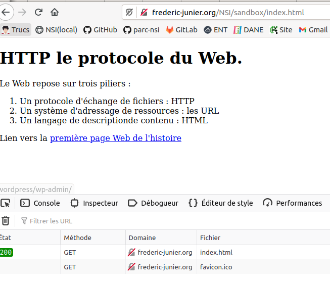{width=50%}\

   *  Quelles informations sur le client sont transmises au serveur dans l'entête de la requête ?

        >_Réponse :  Le client transmet plusieurs paramètres dans sa requête :_
        > _La méthode du protocole [HTTP](HTTP) qui est utilisée, ici [GET](GET) qui permet de demander une ressource_
        > _La version du protocole [HTTP](HTTP) ici 1.1, c'est important de se mettre d'accord sur les règles du dialogue lorsqu'on communique !_
        > _`Accept` précise les types de contenus que le client pourra interpréter_
        > _`Accept-Language` précise la variante de la locale_
        > _`Connection` précise si le client souhaite une connexion persistante après l'échange requête/réponse avec le serveur : on garde la même connexion [TCP](TCP)_
        > _`Cache-Control` et `If-Modified-Since` contiennent des directives pour la mise en cache ou l'utilisation du cache du client_
        > _`User-Agent` contient différentes informations sur le navigateur et le système d'exploitation du client_

    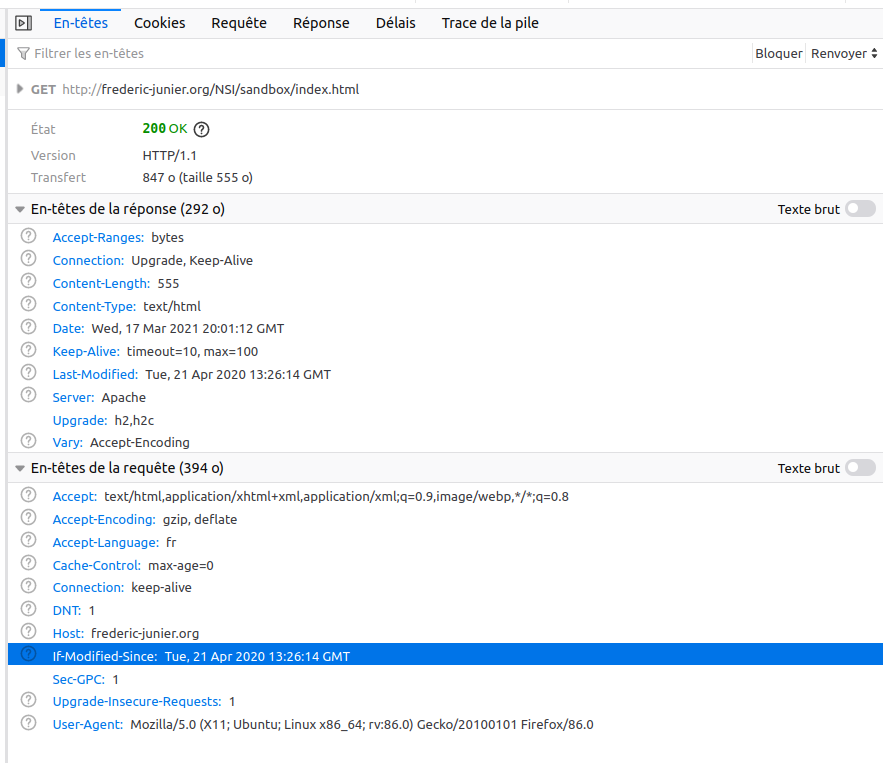{width=100%}\
    
   *  Quelles informations sur le serveur sont transmises au client dans l'entête de la réponse ?

    >_Réponse :  Le serveur transmet plusieurs paramètres dans sa réponse :_
    > _`Content-Length` précise la taille en octets de la réponse_
    > _`Content-Type` précise le type de contenu de la réponse, ici du HTML_
    > _`Date` contient un horodatage de la réponse_
    > _`Laste-Modified` contient un horodatage de la dernière modification de la ressource_
    > _`Server` précise le type de logiciel serveur, ici [Apache](http://www.apache.org/)_

   *  Effectuer une nouvelle requête avec l'[URL][URL] [http://frederic-junier.org/NSI/sandbox/](http://frederic-junier.org/NSI/sandbox/). Quelle différence avec la requête initiale ?

    >_Réponse : La page renvoyée est la même mais avec le  code de réponse de redirection 304 Not Modified indique qu'il n'y a pas besoin de retransmettre les ressources demandées. C'est une redirection implicite vers une ressource mise en cache. Cela survient lorsque la méthode de requête est safe (par exemple une requête GET ou HEAD), ou lorsque la requête est conditionnelle et utilise l'en-tête If-None-Match ou If-Modified-Since. Noter que si le chemin de la ressource dans l'[URL](URL) ne se termine pas par un fichier alors le serveur Web renvoie le fichier par défaut  `index.html` s'il existe_

   *  Effectuer une nouvelle requête avec l'[URL][URL] [https://frederic-junier.org/NSI/sandbox/](https://frederic-junier.org/NSI/sandbox/). Quelle différence avec la requête initiale peut-on observer dans la barre d'adresse du navigateur  ?

    >_Réponse : cette fois le petit cadenas n'est pas barré, la connexion est sécurisée : chiffrée en [HTTPS](HTTPS) et le serveur est authentifié par un certificat SSL à jour._

    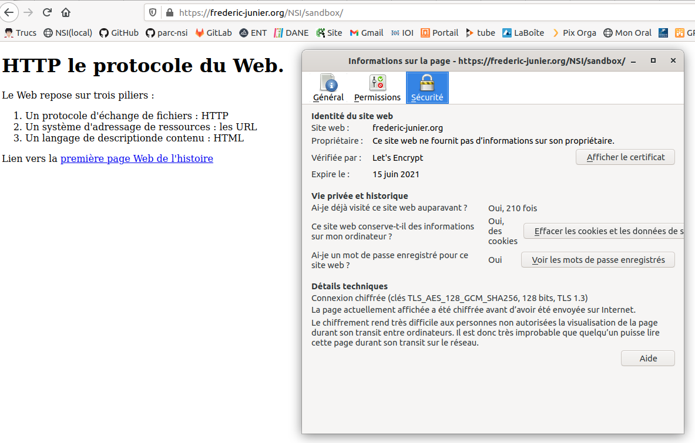{width=80%}\

   *  Effectuer une nouvelle requête avec l'[URL][URL] [http://frederic-junier.org/NSI/Sandbox/index.html](http://frederic-junier.org/NSI/Sandbox/index.html). Quel est le code d'état de la réponse ? Explication ?

      >_Réponse : cette fois on a une erreur 404, c'est une erreur du client qui a demandé une ressource qui n'existe pas sur  le serveur. Pourquoi ? C'est un problème de casse de caractère dans l'[URL](URL) où il ne faut pas de majuscule sur sandbox._

    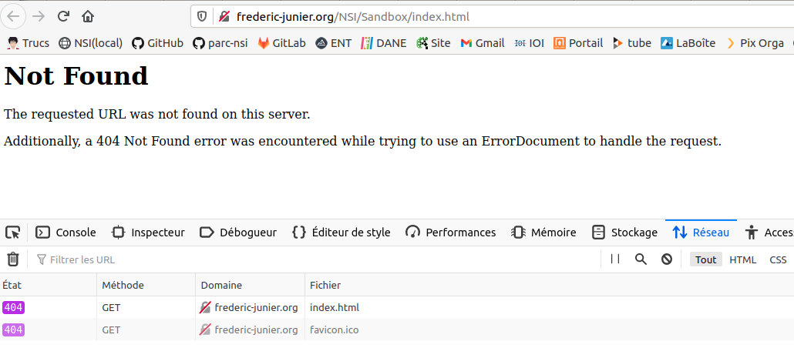{width=80%}\

   *  Effectuer une nouvelle requête avec l'[URL][URL] [http://frederic-junier.org/NSI/interdit](http://frederic-junier.org/NSI/interdit). Quel est le code d'état de la réponse ? Explication ?

    >_Réponse : cette fois on a une erreur 403 Forbidden : le  serveur comprend la requête mais refuse de l'autoriser. En effet, les droits d'accès sur le répertoire interdit sont positionnés à 710 soit  RWX--X---, donc aucun droit pour un utilisateur "autre"_

    {width=80%}\

    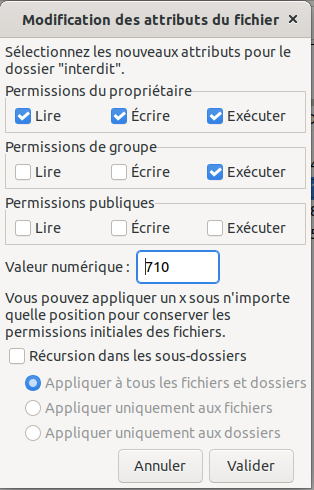{width=50%}\

2. Le site [https://httpie.org/](https://httpie.org/) propose un client HTTP en ligne de commandes permettant de décomposer les requêtes HTTP en précisant la méthode et l'URL de la ressource demandée. 
   * Ouvrir la page [https://httpie.org/run](https://httpie.org/run) 
   * Saisir la commande `http -v GET https://frederic-junier.org/NSI/sandbox/index.html`. Décrire le fonctionnement de la méthode `GET` du protocole `HTTP` : formats de la requête et de la réponse.
  
    > _Réponse : la méthode [GET](GET) du protocole [HTTP](HTTP) est celle qui s'exécute par défaut lorsqu'on effectue une requête en saisissant l'[URL](URL) de la page dans la barre d'adresse du navigateur. Voir ci-dessus pour les en-têtes client/serveur. On voit aussi apparaître le contenu de la réponse : le code source [HTML](HTML) de la page demandée._

    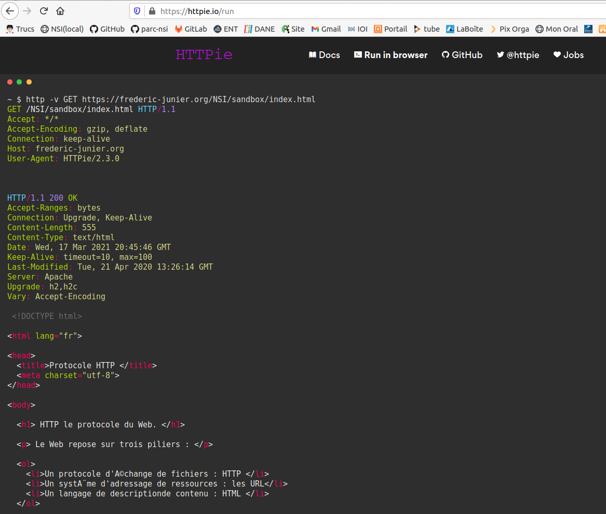{width=80%}\

   * Saisir la commande `http -v HEAD https://frederic-junier.org/NSI/sandbox/index.html`. Décrire le fonctionnement de la méthode `HEAD` du protocole `HTTP` : formats de la requête et de la réponse.

    > _Réponse : Avec la méthode `HEAD` on ne récupère que les en-têtes._

    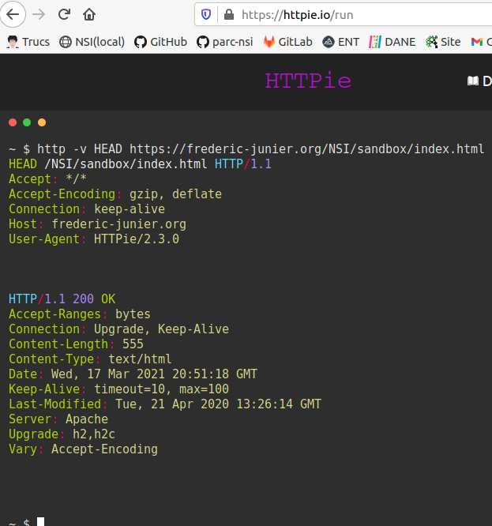{width=80%}\

   * Saisir la commande `http -v PUT https://frederic-junier.org/NSI/sandbox/index.html hello=world`. Quel résultat obtient-on ?  Explication ^[Note : Méthodes HTTP : voir [https://developer.mozilla.org/fr/docs/Web/HTTP/M%C3%A9thode](https://developer.mozilla.org/fr/docs/Web/HTTP/M%C3%A9thode)] ?

    > _Réponse: La méthode PUT remplace toutes les représentations actuelles de la ressource visée par le contenu de la requête.Ici le serveur renvoie un code d'erreur 403 FORBIDDEN car un utilisateur "autre" ne peut pas modifier la ressource (heureusement)._

{width=80%}\

:::

## Passage de paramètres dans une URL

:::exercice

Ouvrir un navigateur Web.

1. Demander la page  d'adresse [http://frederic-junier.org/NSI/sandbox/accueil.php](https://frederic-junier.org/NSI/sandbox/accueil.php)  

    Quel est l'affichage obtenu ? 

    >_Réponse : La requête est envoyée avec la méthode [GET](GET), le code 200 de la réponse du serveur indique un succès_
   
   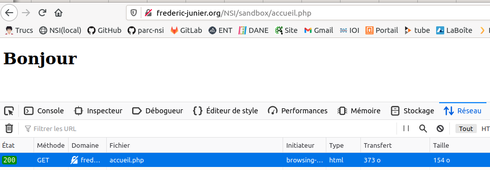{width=80%}\

2. Demander la page  d'adresse  
[http://frederic-junier.org/NSI/sandbox/accueil.php?nom=Turing&prenom=Alan](https://frederic-junier.org/NSI/sandbox/accueil.php?nom=Turing&prenom=Alan)  

    Quel est l'affichage obtenu ? Ouvrir les outils de développement avec `F12` puis sélectionner les onglets `Réseau`  et `Paramètres`. 

    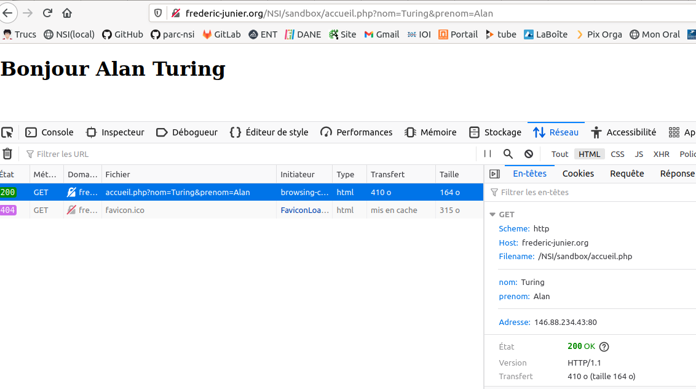{width=80%}\

>_Réponse : Dans la barre des outils de développement, onglet Réseau, on a la décomposition de l'[URL](URL) : le schéma (protocole http ), le nom de domaine (frederic-junier.org), le chemin vers la ressource (/NSI/sandbox/accueil.php) et nouveauté des paramètres assemblés une **chaîne de requête**, elle commence par le symbole `?` puis contient une liste de paires `nom=valeur` séparées par un symbole esperluette `&`. Ces paramètres ne font pas partie de l'adresse de la ressource mais sont une façon pour le client de transmettre des informations au serveur._

 
3. Remplacer Turing par votre nom et Alan par votre prénom dans l'[URL][URL] précédente. Que peut-on remarquer ? À votre avis, que se passe-t-il sur le serveur lorsqu'il reçoit la requête HTTP ?

>_Réponse : côté serveur, un programme doit fabriquer la page [HTML](HTML) renvoyée au client à la volée en fonction des paramètres transmis. On parle dans ce cas de **page web dynamique**. Le programme s'exécutant côté serveur est écrit en [PHP](PHP). On donne le code ci-dessous_
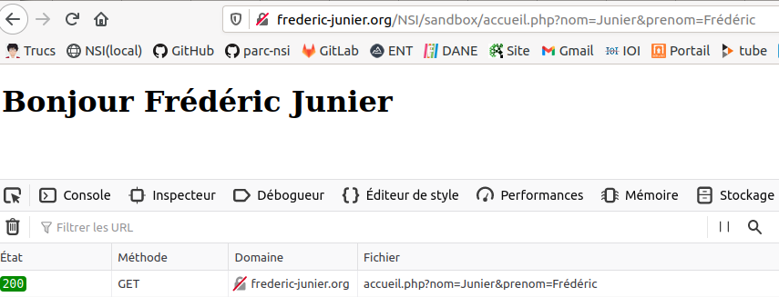{width=80%}\

4. Voici le contenu du fichier `accueil.php` sur le serveur. S'agit-il d'un texte écrit   en  [HTML][HTML] ? Faire une recherche sur la signification de l'acronyme [PHP][PHP].

~~~php
 <!DOCTYPE html>
<html lang="fr">
<head>
  <title>Accueil </title>
  <meta charset="utf-8">    
</head> 
<body>
<h1>
<?php  
echo "Bienvenue " . $_GET['prenom'] . " " .  $_GET['nom'] ;
?>
</h1>
</body>
</html> 
~~~

4. Enregistrer l'[URL][URL] testée précédemment  dans les marque-pages du navigateur. Ouvrir un autre onglet et cliquer sur le signet enregistré. Retrouve-t-on la même page Web ?

>_Réponse : il est tout à fait possible d'enregistrer une  [URL][URL] avec paramètres dans les signets de son navigateur._
:::

# Formulaire et passage de paramètres

## Un premier exemple

:::exemple

1. Ouvrir avec un navigateur Web la page d'[URL][URL] :

   [http://frederic-junier.org/NSI/sandbox/formulaire-get.html](http://frederic-junier.org/NSI/sandbox/formulaire-get.html)

   \

   * Cliquer sur le bouton `Envoyer`. Que se passe-t-il ? Rafraîchir la page avec `F5`. Que se passe-t-il ?

    > _Réponse : en cliquant sur le bouton envoyer, on génère côté client une [URL](URL) avec comme paramètres les valeurs des champs du formulaire : <http://frederic-junier.org/NSI/sandbox/accueil.php?prenom=Alan&nom=Turing>. Le client envoie au serveur sa requête avec la méthode [GET](GET) Si on rafraichit la page avec F5, le comportement est répété à l'identique puisque le client construit la même requête  à partir de l'[URL](URL) avec paramètres._

    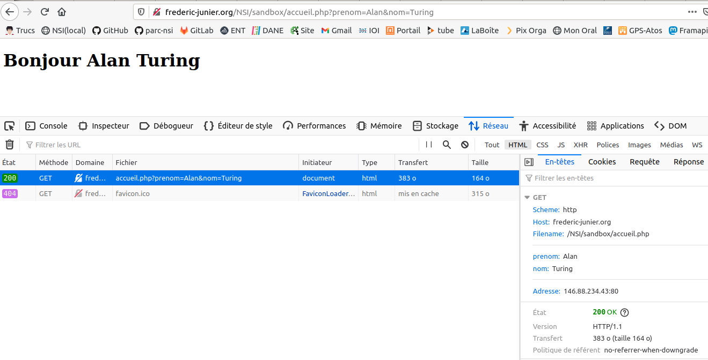\

   * Changer les valeurs des champs `Prénom` et `Nom` du formulaire puis cliquer sur le bouton `Envoyer`. Que se passe-t-il ?

    > _Réponse : mise à jour, une partie de la logique pour générer la  page web dynamique est déportée côté client (choix des paramètres dans une [Interaction Homme Machine](https://interstices.info/domaine/interaction-hommemachine/) représentée par le formulaire). Noter que les paramètres apparaissent dans l'onglet en-tête [GET](GET) des outils de développement et non dans l'onglet Requête_.

   * Ouvrir la fenêtre des outils de développement et afficher dans l'onglet Réseau l'entête de la requête HTTP qui devrait ressembler à celui-ci :
   
   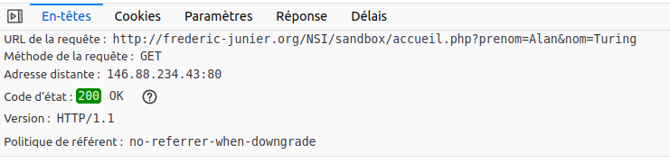{width=80%}\

   Sélectionner l'onglet Paramètres et vérifier qu'on obtient les paramètres transmis à travers l'[URL][URL] dans la chaîne de requête comme dans l'exercice 3.

   * Afficher le code source de la page `formulaire-get.html` avec le raccourci clavier `CRTL + U`. On devrait obtenir le texte ci-dessous :
 
   ~~~html
   <!DOCTYPE html>

   <html lang="fr">

   <head>
   <title>Formulaire HTML </title>
   <meta charset="utf-8">    
   </head> 
   <body>

      <form action = "accueil.php" method="GET">        
         <label for="id_prenom">Prénom :</label>
         <input type="text" id="id_prenom" name="prenom" value="Alan">
         <label for="id_nom">Nom :</label>
         <input type="text" id="id_nom" name="nom" value="Turing">
         <button type="submit" id="bouton">Envoyer</button>
      </form>

   </body>
   </html> 
   ~~~

2. Ouvrir avec un navigateur Web la page d'[URL][URL] :

   [http://frederic-junier.org/NSI/sandbox/formulaire-post.html](http://frederic-junier.org/NSI/sandbox/formulaire-post.html)

   * Cliquer sur le bouton `Envoyer`. Que se passe-t-il ?

    > _Réponse : le serveur renvoie la même page que pour la requête précédente mais cette fois  les paramètres du formulaire ne sont pas transmis à travers l'[URL](URL) et donc dans l'entête [HTTP](HTTP) comme avec la méthode [GET](GET). Ils sont transmis dans le corps de la requête [HTTP](HTTP) comme on peut le voir   dans l'onglet Requête des outils de développement. On peut remarquer que la méthode de la requête [HTTP](HTTP) a changé, il s'agit de la méthode [POST](POST)_.

    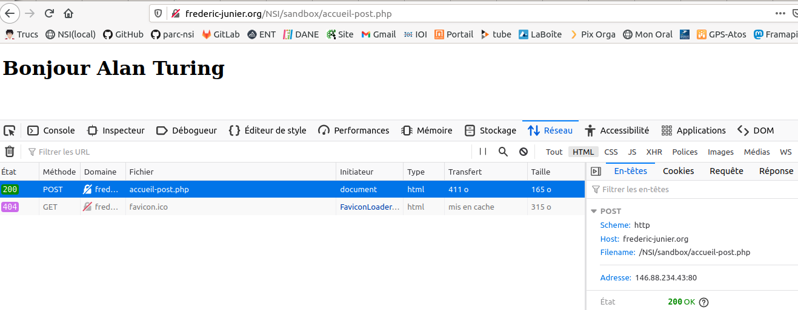{width=80%}\

    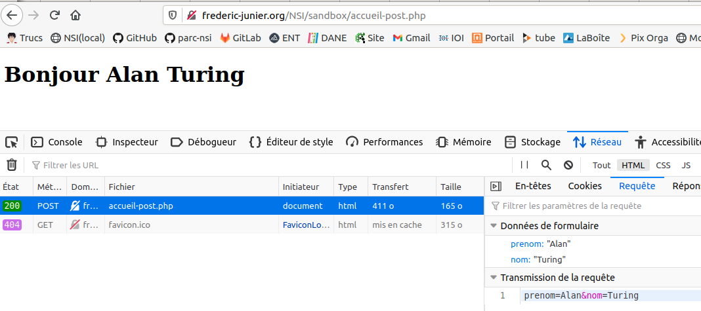{width=80%}\

   * Changer les valeurs des champs `Prénom` et `Nom` du formulaire puis cliquer sur le bouton `Envoyer`. Que se passe-t-il ? Observe-t-on  un changement dans l'[URL][URL] de la requête ? dans son entête ?

    > _Réponse :comme on l'a écrit ci-dessus, la méthode [POST](POST) n'envoie pas les paramètres de formulaire à travers l'[URL](URL) et l'entête [HTTP](HTTP) comme avec la méthode [GET](GET) mais directement dans le corps de la requête_.
> 
   * Rafraîchir la page avec `F5`. Que se passe-t-il ?

     > _Réponse :  [HTTP](HTTP) est un protocole sans mémoire, pour générer la page web il faut renvoyer les paramètres qui ne sont  pas dans l'[URL](URL) d'où l'avertissement ci-dessous._

   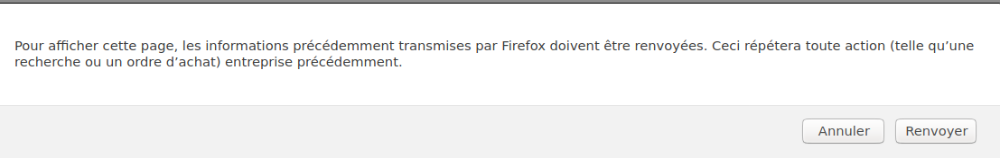{width=70%}\

   * Ouvrir la fenêtre des outils de développement et afficher dans l'onglet Réseau l'entête de la requête HTTP qui devrait ressembler à celui-ci :

   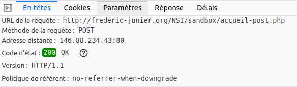{width=60%}\

   Sélectionner l'onglet Paramètres et vérifier qu'on retrouve  les paramètres transmis dans l'[URL][URL]. Quelle différence par rapport à la méthode vue en question 1 ? 

   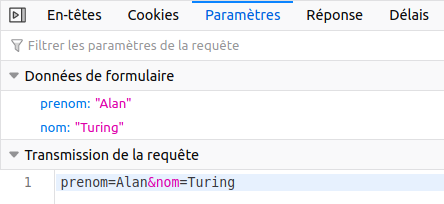{width=40%}\

   * Afficher le code source de la page `formulaire-post.html`  avec le raccourci clavier `CRTL + U`.
   Quels sont  les  deux changements par rapport au code  de `formulaire-get.html` ?

    >_Réponse :  

~~~html
 <!DOCTYPE html>

<html lang="fr">

<head>
  <title>Formulaire HTML </title>
  <meta charset="utf-8">    
</head>
 
<body>

    <!-- Changement dans la balise form par rapport à formulaire-get.html : la cible et la méthode  -->
    <form action = "accueil-post.php" method="post">
        
        <label for="id_prenom">Prénom :</label>
        <input type="text" id="id_prenom" name="prenom" value="Alan">

        <label for="id_nom">Nom :</label>
        <input type="text" id="id_nom" name="nom" value="Turing">

        <button type="submit" id="bouton">Envoyer</button>

    </form>

</body>
</html> 
~~~

:::

## Méthodes de passage des paramètres : GET ou POST

:::exercice

_QCM_ de type E3C2.

1. Parmi les réponses suivantes, que permet d'effectuer la méthode [POST][POST] du protocole [HTTP][HTTP] ?

   * Réponse A :  Définir le style d'une page web
   * Réponse B : Pirater des données bancaire  
   * Réponse C :  Envoyer une page web vers le client  
   * Réponse D :  Envoyer les données saisies dans un formulaire HTML vers un serveur **=> BONNE RÉPONSE**

2. Un site internet utilise une requête [HTTP][HTTP] avec la méthode [POST][POST] pour transmettre les données d'un formulaire. Laquelle des affirmations suivantes est **incorrecte** ?

   * Réponse A : les données envoyées ne sont pas visibles **=> BONNE RÉPONSE**
   * Réponse B : il est possible de transmettre des données de type binaire 
   * Réponse C :  les données transmises sont cryptées 
   * Réponse D :  il n'y a pas de restriction de longueur pour les données transmises

3. Un internaute clique sur un lien qui envoie la requête [HTTP][HTTP] suivante à un serveur :

   `http://jaimelaneige.com/ma_planche/traitement.php?nom=Snow&prenom=Jon`

   Que demande cette requête au serveur ?

   * Réponse A :  de renvoyer le fichier traitement.php en identifiant nom et prénom à Snow et Jon
   * Réponse B : d'exécuter le fichier traitement.php en identifiant nom et prénom à Snow et Jon **=> BONNE RÉPONSE**
   * Réponse C :  d'indiquer si Jon Snow a bien pris son traitement
   * Réponse D : de renvoyer le fichier traitement.php en affichant prénom et nom : Jon
:::

## Eléments de formulaire

:::exercice

1. Ouvrir dans un navigateur Web la page dont l'[URL][URL] est  :  
   <https://repl.it/@fredericjunier/NSI-formulaire-exo5-radio>.
   * Cliquer sur `Run` pour lancer le serveur, remplir le formulaire contenu dans le fichier `index.php` et envoyer les données. Quelle méthode est utilisée pour le passage des paramètres du formulaire ?

> _Réponse : Les paramètres du formulaire sont transmis avec la méthode [POST](POST)_  _

\

   * Modifier les codes sources des fichiers `index.php` et `navigateur.php` pour changer  la méthode de passage   des paramètres du formulaire. En [PHP][PHP], on récupère la valeur du paramètre `nom` avec `$_GET['nom']` si la méthode est [GET][GET] ou  `$_POST['nom']` si c'est [POST][POST].

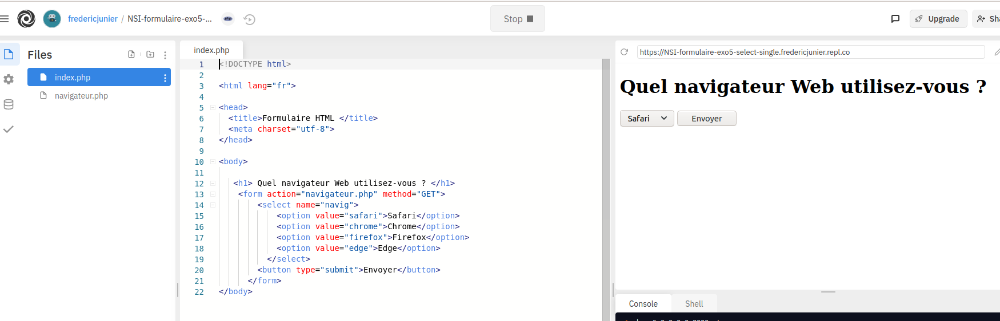\

> _Réponse : code source modifié du fichier qui contient le formulaire `index.php`_

~~~php
<!DOCTYPE html>

<html lang="fr">

<head>
  <title>Formulaire HTML </title>
  <meta charset="utf-8">    
</head>
 
<body>

   <h1> Quel navigateur Web utilisez-vous ? </h1>
    <form action="navigateur.php" method="GET">
        <select name="navig">
            <option value="safari">Safari</option>
            <option value="chrome">Chrome</option>
            <option value="firefox">Firefox</option>
            <option value="edge">Edge</option>
          </select> 
        <button type="submit">Envoyer</button>
      </form> 
</body>
~~~

> _Réponse : code source modifié du fichier qui génère la page  à partir des données du formulaire `navigateur.php`_

~~~php
<!DOCTYPE html>

<html lang="fr">

<head>
  <title>Accueil </title>
  <meta charset="utf-8">    
</head>
 
<body>

<h1>
<?php  
echo "Vous utilisez le navigateur " . $_GET['navig'] ;
?>
</h1>

<a href="index.php">Retour au formulaire</a>
</body>
</html> 
~~~

   * Consulter la  documentation sur l'élément  de formulaire `<select>` contenue dans la page [https://www.w3schools.com/html/html_form_elements.asp](https://www.w3schools.com/html/html_form_elements.asp) et remplacer les `<input>` de type `radio` du formulaire dans `index.php` par un élément `<select>`  avec choix unique.

2. Ouvrir dans un navigateur Web la page dont l'[URL][URL] est :  
   <https://repl.it/@fredericjunier/NSI-formulaire-exo5-checkbox>.
   * Cliquer sur `Run` pour lancer le serveur, remplir le formulaire contenu dans le fichier `index.php` et envoyer les données. Quelle méthode est utilisée pour le passage des paramètres du formulaire ?

    > _Réponse : les paramètres de formulaire sont envoyés avec la méthode [GET](GET)_

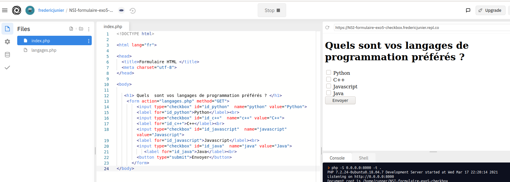\

   * Modifier les codes sources des fichiers `index.php` et `langages.php` pour changer  la méthode de passage   des paramètres du formulaire.

> _Réponse : code de `index.php` pour utiliser la méthode [POST](POST)_

~~~php
<!DOCTYPE html>

<html lang="fr">

<head>
  <title>Formulaire HTML </title>
  <meta charset="utf-8">    
</head>
 
<body>

   <h1> Quels  sont vos langages de programmation préférés ? </h1>
    <form action="langages.php" method="POST">
        <input type="checkbox" id="id_python"  name="python" value="Python">
        <label for="id_python">Python</label> 
        <input type="checkbox" id="id_c++"  name="c++" value="C++">
        <label for="id_c++">C++</label> 
        <input type="checkbox" id="id_javascript"  name="javascript" value="Javascript">
        <label for="id_javascript">Javascript</label> 
        <input type="checkbox" id="id_java"  name="java" value="Java">
           <label for="id_java">Java</label> 
        <button type="submit">Envoyer</button>
      </form> 
</body>
~~~

> _Réponse : code de `langages.php` pour utiliser la méthode [POST](POST)_

~~~php
<!DOCTYPE html>

<html lang="fr">

<head>
  <title>Accueil </title>
  <meta charset="utf-8">    
</head>
 
<body>

   Vos langages préférés sont :

<ul>
<?php  
foreach ($_POST as $_langage) {
    echo "<li>" . $_langage . "</li>";
}
?>
</ul>

</body>
</html> 
~~~

   * Consulter la  documentation sur l'élément  de formulaire `<select>` contenue dans la page [https://www.w3schools.com/html/html_form_elements.asp](https://www.w3schools.com/html/html_form_elements.asp) et remplacer les `<input>` de type `checkbox` du formulaire dans `index.php` par un élément `<select>`  avec choix multiple. Pour modifier le code [PHP](PHP) on s'inspirera de ce [post stackoverflow](https://stackoverflow.com/questions/2407284/how-to-get-multiple-selected-values-of-select-box-in-php/2407401#2407401).

> _Réponse : code de `index.php` pour utiliser un formulaire  `<select>` multiple_

~~~php
<!DOCTYPE html>

<html lang="fr">

<head>
  <title>Formulaire HTML </title>
  <meta charset="utf-8">    
</head>
 
<body>

   <h1> Quels  sont vos langages de programmation préférés ? </h1>
    <form action="langages.php" method="GET">
      <select  id="top_langages" name="top_langages[]" multiple>
        <option value="Python">
        <label for="id_python">Python</label> 
       <option value="c++">
        <label for="id_c++">C++</label> 
        <option value="javascript">
        <label for="id_javascript">Javascript</label> 
        <option value="java">
           <label for="id_java">Java</label> 
      </select>
        <button type="submit">Envoyer</button>
      </form> 
</body>
~~~

> _Réponse : code de `langages.php` pour utiliser un formulaire  `<select>` multiple_

~~~php
<!DOCTYPE html>

<html lang="fr">

<head>
  <title>Accueil </title>
  <meta charset="utf-8">    
</head>
 
<body>

   Vos langages préférés sont :

<ul>
<?php 
foreach ($_GET["top_langages"] as $_langage) {
    echo "<li>" . $_langage . "</li>";
}
?>
</ul>

</body>
</html> 
~~~

4. Ouvrir dans un navigateur Web la page dont l'[URL][URL] est :  
   <http://frederic-junier.org/NSI/sandbox/NSI-formulaire-exo5-login-get.html>.
   * La page présente un formulaire basique de connexion avec deux champs  `login` et `password`. La valeur de l'identifiant est libre et le mot de passe est `secret`. Remplir  le formulaire et envoyer les données. Quelle méthode de passage des paramètres est utilisée ? La transmission du mot de passe est-elle satisfaisante ?

> _Réponse : la transmission de mot de passe avec [GET](GET) n'est vraiment pas uen bonne idée, les paramètres sont transmis dans l'[URL](URL) et donc dans les entêtes [HTTP](HTTP) qui ne sont jamais chiffrés même en [HTTPS](HTTPS)_
> 
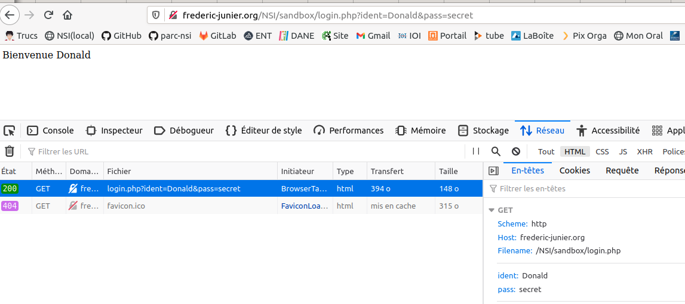\

   * Revenir sur la page du formulaire, ouvrir la fenêtre des outils de développement avec `F12` et modifier le code source pour que l'envoi du mot de passe soit sécurisé.
   
   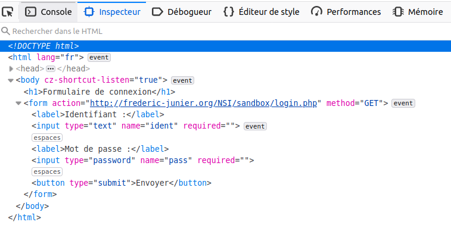{width=60%}\

> _Réponse : on effectue deux modifications dans le code source du formulaire : on utilise la méthode [POST](POST) et on passe en [HTTPS](HTTPS) le protocole de l'[URL](URL) cible_

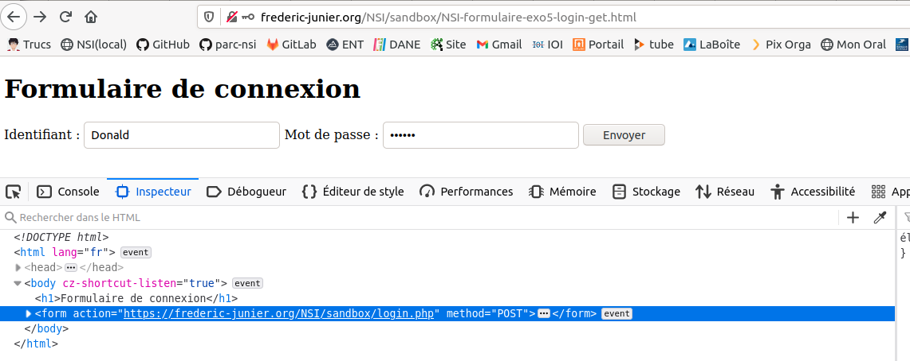\

   * Dans le schéma ci-dessous d'un échange Web sécurisé avec le protocole  [HTTPS][HTTPS], apparaît la notion de [certificat][certificat]. Quel est le rôle d'un [certificat][certificat] et comment est-il géré par le navigateur ?
  

> _Réponse : lire la BD ci-dessous et consulter cette page <https://support.mozilla.org/fr/kb/certificats-authentification-pour-sites-web-securises>_ 

   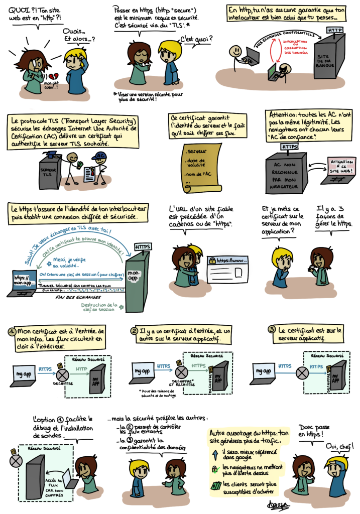{width=87%}\

   _Source : [https://blog.octo.com/bd-le-https/](https://blog.octo.com/bd-le-https/)_
:::