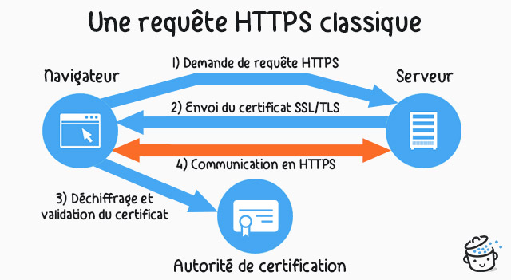

-   [Crédits](#crédits)
-   [Le Web](#le-web)
    -   [Les trois piliers du Web : HTTP, URL et
        HTML](#les-trois-piliers-du-web-http-url-et-html)
    -   [Passage de paramètres dans une
        URL](#passage-de-paramètres-dans-une-url)
-   [Formulaire et passage de
    paramètres](#formulaire-et-passage-de-paramètres)
    -   [Un premier exemple](#un-premier-exemple)
    -   [Méthodes de passage des paramètres : GET ou
        POST](#méthodes-de-passage-des-paramètres-get-ou-post)
    -   [Eléments de formulaire](#eléments-de-formulaire)

Crédits
=======

*Ce cours est largement inspiré du chapitre 28 du manuel NSI de la
collection Tortue chez Ellipsen auteurs : Ballabonski, Conchon,
Filliatre, N’Guyen.*

Le Web
======

<!-- Définition des hyperliens  -->

Les trois piliers du Web : HTTP, URL et HTML
--------------------------------------------

Le Web est une application du réseau Internet qui désigne un réseau de
sources d’information reliées par des liens hypertextes. Le Web
fonctionne selon **l’architecture client/serveur** : la machine *client*
demande à la machine *serveur* une ressource identifiée par son adresse
[URL](https://developer.mozilla.org/fr/docs/Glossaire/URL). Aux débuts
du Web le client était commandé par un humain mais ce peut être un
programme.

<figure>
<figcaption aria-hidden="true">Architecture client serveur</figcaption>
</figure>

Les inventeurs du Web, [Tim
Berners-Lee](https://interstices.info/les-debuts-du-web-sous-loeil-du-w3c/)
et [Robert Caillau](https://fr.wikipedia.org/wiki/Robert_Cailliau) ont
défini au
[CERN](https://fr.wikipedia.org/wiki/Organisation_europ%C3%A9enne_pour_la_recherche_nucl%C3%A9aire)
entre 1989 et 1991 ses trois piliers
[HTTP](https://developer.mozilla.org/fr/docs/Glossaire/HTTP), [URL](URL)
et [HTML](HTML).

**Point de cours 1**

-   Dans un échange sur le Web, le **client** envoie une demande ou
    **requête** à l’aide d’un logiciel appelé **navigateur** [1] : le
    **serveur** est un logiciel installé sur une machine reliée en
    réseau à la machine du client.
-   Le protocole
    [HTTP](https://developer.mozilla.org/fr/docs/Glossaire/HTTP),
    acronyme d’`Hypertext Transfer Protocol`, est un protocole de la
    couche application qui décrit le format des échanges de données
    entre un client et un serveur sur le Web. Un échange HTTP s’établit
    selon le schéma suivant :
    -   Le client saisit une
        [URL](https://developer.mozilla.org/fr/docs/Glossaire/URL) dans
        la barre d’adresse du navigateur, elle est résolue en adresse
        [IP](https://developer.mozilla.org/fr/docs/Glossaire/IP_Address)
        par le service
        [DNS](https://developer.mozilla.org/fr/docs/Glossaire/DNS).
    -   Mise en place d’une connexion [TCP](TCP) entre le client et le
        serveur.
    -   Le client envoie une requête
        [HTTP](https://developer.mozilla.org/fr/docs/Glossaire/HTTP)
        (format texte lisible par un humain).
    -   Le serveur retourne une réponse
        [HTTP](https://developer.mozilla.org/fr/docs/Glossaire/HTTP),
        lue par le client. S’il y a un contenu, il est affiché par le
        navigateur du client.
    -   Fermeture ou réutilisation (paramètre `Keep-alive`) de la
        connexion pour les requêtes suivantes.

Le protocole
[HTTP](https://developer.mozilla.org/fr/docs/Glossaire/HTTP) n’est pas
sécurisé par défaut, il peut l’être par l’ajout du protocole SSL ou TLS
et on désigne par
[HTTPS](https://developer.mozilla.org/fr/docs/Glossaire/https) sa
version sécurisée.
[HTTP](https://developer.mozilla.org/fr/docs/Glossaire/HTTP) est un
standard normalisé par
l’[IETF](https://developer.mozilla.org/fr/docs/Glossaire/IETF) comme les
protocoles d’internet
[TCP](https://developer.mozilla.org/fr/docs/Glossaire/TCP) et
[IP](https://developer.mozilla.org/fr/docs/Glossaire/IP_Address).

<!-- \ -->

  
*Source : <https://developer.mozilla.org/fr/docs/Web/HTTP/Aper%C3%A7u>*

-   Une adresse
    [URL](https://developer.mozilla.org/fr/docs/Glossaire/URL) pour
    `Uniform Ressource Locator` identifie une ressource sur le Web. La
    syntaxe des
    [URL](https://developer.mozilla.org/fr/docs/Glossaire/URL) est
    standardisée, par exemple décomposons :  
    <https://www.gnu.org/gnu/linux-and-gnu.fr.html> :
    -   le protocole est `https` ;
    -   le nom de domaine sur Internet du serveur Web est `gnu.org`.  
        `www.gnu.org` est un sous-domaine servant d’alias pour le
        dossier public du serveur ;
    -   `gnu/linux-and-gnu.fr.html` est le chemin vers la ressource sur
        le serveur : le fichier `linux-and-gnu.fr.html` qui se trouve
        dans le dossier public `gnu`.
-   [HTML](https://developer.mozilla.org/fr/docs/Glossaire/HTML) pour
    `Hypertext Markup Language` est le langage de description des
    documents textes disponibles sur le Web qui sont reliées entre eux
    par des liens hypertextes. Il s’agit d’un langage à balises. En
    pratique, d’autres types de ressources sont accessibles sur le Web
    par une [URL](https://developer.mozilla.org/fr/docs/Glossaire/URL) :
    des images, des fichiers de données (aux formats CSV, JSON …), des
    videos … Par ailleurs les pages sont désormais réalisées en
    combinant
    [HTML](https://developer.mozilla.org/fr/docs/Glossaire/HTML) avec
    [CSS](https://developer.mozilla.org/fr/docs/Glossaire/CSS) pour la
    mise en forme, le positionnement, certains effets visuels et
    [Javascript](https://developer.mozilla.org/fr/docs/Glossaire/JavaScript)
    pour la programmation événementielle nécessaire à l’interactivité
    côté client.

  

*Source :* https://developer.mozilla.org/fr/docs/Glossaire/HTML

**Exercice 1**

*QCM* de type E3C2.

Pour répondre à la première question, relisez la [synthèse de cours sur
HTML/CSS](https://parc-nsi.github.io/premiere-nsi/chapitre2/memo/MemoHTML-CSS-2020.pdf).

1.  Quelle est le code HTML permettant de créer un lien hypertexte dans
    un document écrit en
    [HTML](https://developer.mozilla.org/fr/docs/Glossaire/HTML) ?
    -   Réponse A : `<a\>http://tip-top.fr </a>`
    -   Réponse B : `<a href="http://tip-top.fr">Site du TIP-TOP</a>`
    -   Réponse C : `<a name="http://tip.top.fr</a>`
2.  Comment s'appelle le service qui permet de faire le lien entre une
    IP et un nom de domaine ?
    -   Réponse A : DNS
    -   Réponse B : ARP
    -   Réponse C : HTTP
    -   Réponse D : Internet

**Exercice 2**

  
*Source : <https://developer.mozilla.org/fr/docs/Web/HTTP/Aper%C3%A7u>*

1.  Avec un navigateur Web, demander la page d’adresse  
    <http://frederic-junier.org/NSI/sandbox/index.html>.  
    Ouvrir la barre d’outils de développement en appuyant sur la touche
    de fonction `F12` et sélectionner l’onglet Réseau. On peut voir les
    entêtes de la requête et de la réponse HTTP.

    -   Que représente le code d’état de la réponse HTTP ?
    -   Quelles informations sur le client sont transmises au serveur
        dans l’entête de la requête ?
    -   Quelles informations sur le serveur sont transmises au client
        dans l’entête de la réponse ?
    -   Effectuer une nouvelle requête avec
        l’[URL](https://developer.mozilla.org/fr/docs/Glossaire/URL)
        <http://frederic-junier.org/NSI/sandbox/>. Quelle différence
        avec la requête initiale ?
    -   Effectuer une nouvelle requête avec
        l’[URL](https://developer.mozilla.org/fr/docs/Glossaire/URL)
        <https://frederic-junier.org/NSI/sandbox/>. Quelle différence
        avec la requête initiale peut-on observer dans la barre
        d’adresse du navigateur ?
    -   Effectuer une nouvelle requête avec
        l’[URL](https://developer.mozilla.org/fr/docs/Glossaire/URL)
        <http://frederic-junier.org/NSI/Sandbox/index.html>. Quel est le
        code d’état de la réponse ? Explication ?
    -   Effectuer une nouvelle requête avec
        l’[URL](https://developer.mozilla.org/fr/docs/Glossaire/URL)
        <http://frederic-junier.org/NSI/interdit>. Quel est le code
        d’état de la réponse ? Explication ?

2.  Le site <https://httpie.org/> propose un client HTTP en ligne de
    commandes permettant de décomposer les requêtes HTTP en précisant la
    méthode et l’URL de la ressource demandée.

    -   Ouvrir la page <https://httpie.org/run>
    -   Saisir la commande
        `http -v GET https://frederic-junier.org/NSI/sandbox/index.html`.
        Décrire le fonctionnement de la méthode `GET` du protocole
        `HTTP` : formats de la requête et de la réponse.
    -   Saisir la commande
        `http -v HEAD https://frederic-junier.org/NSI/sandbox/index.html`.
        Décrire le fonctionnement de la méthode `HEAD` du protocole
        `HTTP` : formats de la requête et de la réponse.
    -   Saisir la commande
        `http -v PUT https://frederic-junier.org/NSI/sandbox/index.html hello=world`.
        Quel résultat obtient-on ? Explication [2] ?

  

Passage de paramètres dans une URL
----------------------------------

**Exercice 3**

Ouvrir un navigateur Web.

1.  Demander la page d’adresse
    [http://frederic-junier.org/NSI/sandbox/accueil.php](https://frederic-junier.org/NSI/sandbox/accueil.php)

    Quel est l’affichage obtenu ?

2.  Demander la page d’adresse  
    [http://frederic-junier.org/NSI/sandbox/accueil.php?nom=Turing&prenom=Alan](https://frederic-junier.org/NSI/sandbox/accueil.php?nom=Turing&prenom=Alan)

    Quel est l’affichage obtenu ? Ouvrir les outils de développement
    avec `F12` puis sélectionner les onglets `Réseau` et `Paramètres`.

    **La partie `?nom=Turing&prenom=Alan` de
    l’[URL](https://developer.mozilla.org/fr/docs/Glossaire/URL) est une
    *chaîne de requête*, elle commence par le symbole `?` puis contient
    une liste de paires `nom=valeur` séparées par un symbole esperluette
    `&`. Ces paramètres ne font pas partie de l’adresse de la ressource
    mais sont une façon pour le client de transmettre des informations
    au serveur.**

      

3.  Remplacer Turing par votre nom et Alan par votre prénom dans
    l’[URL](https://developer.mozilla.org/fr/docs/Glossaire/URL)
    précédente. Que peut-on remarquer ? À votre avis, que se passe-t-il
    sur le serveur lorsqu’il reçoit la requête HTTP ?

4.  Voici le contenu du fichier `accueil.php` sur le serveur. S’agit-il
    d’un texte écrit en
    [HTML](https://developer.mozilla.org/fr/docs/Glossaire/HTML) ? Faire
    une recherche sur la signification de l’acronyme
    [PHP](https://developer.mozilla.org/fr/docs/Glossaire/PHP).

``` php
 <!DOCTYPE html>
<html lang="fr">
<head>
  <title>Accueil </title>
  <meta charset="utf-8">    
</head> 
<body>
<h1>
<?php  
echo "Bienvenue " . $_GET['prenom'] . " " .  $_GET['nom'] ;
?>
</h1>
</body>
</html> 
```

1.  Enregistrer
    l’[URL](https://developer.mozilla.org/fr/docs/Glossaire/URL) testée
    précédemment dans les marque-pages du navigateur. Ouvrir un autre
    onglet et cliquer sur le signet enregistré. Retrouve-t-on la même
    page Web ?

Formulaire et passage de paramètres
===================================

Un premier exemple
------------------

**Exemple 1**

1.  Ouvrir avec un navigateur Web la page
    d’[URL](https://developer.mozilla.org/fr/docs/Glossaire/URL) :

    <http://frederic-junier.org/NSI/sandbox/formulaire-get.html>

      

    -   Cliquer sur le bouton `Envoyer`. Que se passe-t-il ? Rafraîchir
        la page avec `F5`. Que se passe-t-il ?
    -   Changer les valeurs des champs `Prénom` et `Nom` du formulaire
        puis cliquer sur le bouton `Envoyer`. Que se passe-t-il ?
    -   Ouvrir la fenêtre des outils de développement et afficher dans
        l’onglet Réseau l’entête de la requête HTTP qui devrait
        ressembler à celui-ci :

      

    Sélectionner l’onglet Paramètres et vérifier qu’on obtient les
    paramètres transmis à travers
    l’[URL](https://developer.mozilla.org/fr/docs/Glossaire/URL) dans la
    chaîne de requête comme dans l’exercice 3.

    -   Afficher le code source de la page `formulaire-get.html` avec le
        raccourci clavier `CRTL + U`. On devrait obtenir le texte
        ci-dessous :

    ``` html
    <!DOCTYPE html>

    <html lang="fr">

    <head>
    <title>Formulaire HTML </title>
    <meta charset="utf-8">    
    </head> 
    <body>

       <form action = "accueil.php" method="GET">        
          <label for="id_prenom">Prénom :</label>
          <input type="text" id="id_prenom" name="prenom" value="Alan">
          <label for="id_nom">Nom :</label>
          <input type="text" id="id_nom" name="nom" value="Turing">
          <button type="submit" id="bouton">Envoyer</button>
       </form>

    </body>
    </html> 
    ```

2.  Ouvrir avec un navigateur Web la page
    d’[URL](https://developer.mozilla.org/fr/docs/Glossaire/URL) :

    <http://frederic-junier.org/NSI/sandbox/formulaire-post.html>

    -   Cliquer sur le bouton `Envoyer`. Que se passe-t-il ?
    -   Changer les valeurs des champs `Prénom` et `Nom` du formulaire
        puis cliquer sur le bouton `Envoyer`. Que se passe-t-il ?
        Observe-t-on un changement dans
        l’[URL](https://developer.mozilla.org/fr/docs/Glossaire/URL) de
        la requête ? dans son entête ?
    -   Rafraîchir la page avec `F5`. Que se passe-t-il ?

      

    -   Ouvrir la fenêtre des outils de développement et afficher dans
        l’onglet Réseau l’entête de la requête HTTP qui devrait
        ressembler à celui-ci :

      

    Sélectionner l’onglet Paramètres et vérifier qu’on retrouve les
    paramètres du formulaire. Quelle différence par rapport à la méthode
    vue en question 1 ?

      

    -   Afficher le code source de la page `formulaire-post.html` avec
        le raccourci clavier `CRTL + U`. Quels sont les deux changements
        par rapport au code de `formulaire-get.html` ?

Méthodes de passage des paramètres : GET ou POST
------------------------------------------------

**Point de cours 2**

En [HTML](https://developer.mozilla.org/fr/docs/Glossaire/HTML), un
formulaire est un élément qui permet de transmettre des informations à
un serveur Web. Il est composé d’un élément
`<form action="http://domaine/cible" method="GET" >` qui contient un ou
plusieurs widgets, des éléments
[HTML](https://developer.mozilla.org/fr/docs/Glossaire/HTML) permettant
de saisir les entrées du client et au moins un élément
`<button type="submit>Bouton d'envoi</button>`. Un clic sur ce dernier
déclenche l’exécution d’une requête
[HTTP](https://developer.mozilla.org/fr/docs/Glossaire/HTTP) qui va
transmettre les données saisies selon les valeurs des attributs `action`
et `method` de l’élément `<form>` :

-   `action` a pour valeur
    l’[URL](https://developer.mozilla.org/fr/docs/Glossaire/URL) du
    fichier auquel sera envoyé le formulaire. Ce fichier est un
    programme écrit dans un langage de script comme
    [PHP](https://developer.mozilla.org/fr/docs/Glossaire/PHP) ou
    [Python](https://docs.python.org/3.7/library/cgi.html), qui va
    prendre en entrée les paramètres du formulaire transmis par le
    client, les traiter et générer la page Web en
    [HTML](https://developer.mozilla.org/fr/docs/Glossaire/HTML) qui lui
    sera renvoyée.
-   `method` peut prendre deux valeurs
    [GET](https://developer.mozilla.org/fr/docs/Web/HTTP/M%C3%A9thode/GET)
    ou
    [POST](https://developer.mozilla.org/fr/docs/Web/HTTP/M%C3%A9thode/POST)
    (en minuscule ou majuscule), ce sont les deux modes de transmission
    des paramètres du formulaire qui sont deux méthodes distinctes du
    protocole
    [HTTP](https://developer.mozilla.org/fr/docs/Glossaire/HTTP) :
    -   avec la méthode
        [GET](https://developer.mozilla.org/fr/docs/Web/HTTP/M%C3%A9thode/GET)
        , les données du formulaire sont assemblées dans une chaîne de
        paires `nom=valeur` séparées par le symbole `&` qui est ajouté à
        la fin de
        l’[URL](https://developer.mozilla.org/fr/docs/Glossaire/URL)
        après le délimiteur `?`.
    -   avec la méthode
        [POST](https://developer.mozilla.org/fr/docs/Web/HTTP/M%C3%A9thode/POST)
        les données du formulaire sont transmises toujours dans le corps
        de la requête. Les données n’apparaissent donc pas dans
        l’[URL](https://developer.mozilla.org/fr/docs/Glossaire/URL).

  

Le formulaire du fichier `formulaire-get.html` de l’exemple 1 contient
deux widgets `<input>`. Chacun va fournir un couple `nom=valeur`, le nom
est désigné par l’attribut `name` et la valeur par le texte saisi dans
l’élément `<input>`. Chacun est associé par son attribut `id` à une
étiquette contenue dans un élément `<label>`.

Caractéristiques de la méthode
[GET](https://developer.mozilla.org/fr/docs/Web/HTTP/M%C3%A9thode/GET) :

-   Toutes les informations transmises, le sont en clair dans
    l’[URL](https://developer.mozilla.org/fr/docs/Glossaire/URL).
    Celle-ci est limitée en taille donc la méthode
    [GET](https://developer.mozilla.org/fr/docs/Web/HTTP/M%C3%A9thode/GET)
    ne peut pas être utilisée pour transmettre des informations trop
    longues.
-   Une requête
    [GET](https://developer.mozilla.org/fr/docs/Web/HTTP/M%C3%A9thode/GET)
    est constituée uniquement d’un entête, elle n’a pas de corps.
-   Elle ne modifie pas l’état du serveur, elle est utilisée uniquement
    pour demander une ressource. Un exemple classique d’utilisation est
    la formulation d’une requête à l’aide du formulaire d’un moteur de
    recherche.
    L’[URL](https://developer.mozilla.org/fr/docs/Glossaire/URL) générée
    peut être utilisée plusieurs fois et conservée comme marque-page.

Caractéristiques de la méthode
[POST](https://developer.mozilla.org/fr/docs/Web/HTTP/M%C3%A9thode/POST)
:

-   Les données sont transmises dans le corps de la requête, il n’y a
    pas de restriction de taille. Elles peuvent être de tout type :
    url-encodées (chaîne de paires `nom=valeur`), ou binaires. C’est
    précisé dans le champ `Content-type` de l’entête comme pour une
    réponse
    [HTTP](https://developer.mozilla.org/fr/docs/Glossaire/HTTP).
-   Les données n’apparaissent pas dans
    l’[URL](https://developer.mozilla.org/fr/docs/Glossaire/URL),
    néanmoins, si le protocole
    [HTTP](https://developer.mozilla.org/fr/docs/Glossaire/HTTP) est
    employé sans chiffrement, il suffit d’intercepter la requête pour
    accéder aux données en clair.
-   Les données envoyées peuvent modifier l’état du serveur. Par
    exemple, les requêtes
    [POST](https://developer.mozilla.org/fr/docs/Web/HTTP/M%C3%A9thode/POST)
    sont utilisées pour les modifications de bases de données sur le
    serveur (achats, réservation, transfert de fichiers …). Par
    conséquent si on veut renvoyer les données d’un formulaire, un
    message en popup avertit que ce nouvel envoi peut modifier l’état du
    serveur et par exemple d’enregistrer un nouvel achat s’il s’agit
    d’un formulaire de commande.

**Exercice 4**

*QCM* de type E3C2.

1.  Parmi les réponses suivantes, que permet d’effectuer la méthode
    [POST](https://developer.mozilla.org/fr/docs/Web/HTTP/M%C3%A9thode/POST)
    du protocole
    [HTTP](https://developer.mozilla.org/fr/docs/Glossaire/HTTP) ?

    -   Réponse A : Définir le style d’une page web
    -   Réponse B : Pirater des données bancaire
    -   Réponse C : Envoyer une page web vers le client
    -   Réponse D : Envoyer les données saisies dans un formulaire HTML
        vers un serveur

2.  Un site internet utilise une requête
    [HTTP](https://developer.mozilla.org/fr/docs/Glossaire/HTTP) avec la
    méthode
    [POST](https://developer.mozilla.org/fr/docs/Web/HTTP/M%C3%A9thode/POST)
    pour transmettre les données d’un formulaire. Laquelle des
    affirmations suivantes est **incorrecte** ?

    -   Réponse A : les données envoyées ne sont pas visibles
    -   Réponse B : il est possible de transmettre des données de type
        binaire
    -   Réponse C : les données transmises sont cryptées
    -   Réponse D : il n’y a pas de restriction de longueur pour les
        données transmises

3.  Un internaute clique sur un lien qui envoie la requête
    [HTTP](https://developer.mozilla.org/fr/docs/Glossaire/HTTP)
    suivante à un serveur :

    `http://jaimelaneige.com/ma_planche/traitement.php?nom=Snow&prenom=Jon`

    Que demande cette requête au serveur ?

    -   Réponse A : de renvoyer le fichier traitement.php en identifiant
        nom et prénom à Snow et Jon
    -   Réponse B : d’exécuter le fichier traitement.php en identifiant
        nom et prénom à Snow et Jon
    -   Réponse C : d’indiquer si Jon Snow a bien pris son traitement
    -   Réponse D : de renvoyer le fichier traitement.php en affichant
        prénom et nom : Jon

Eléments de formulaire
----------------------

**Point de cours 3**

1.  Le principal élément permettant la saisie de données dans un champ
    de formulaire
    [HTML](https://developer.mozilla.org/fr/docs/Glossaire/HTML) est
    `<input>`. Son attribut `type` permet de vérifier que les données
    saisies correspondent au type attendu.

    | Type                          | Exemple de syntaxe                                            |
    |:------------------------------|:--------------------------------------------------------------|
    | Texte                         | `<input type="text"  name="t"  value="Défaut">`               |
    | Email                         | `<input type="email"  name="a"  value="defaut@defaut.fr">`    |
    | Nombre                        | `<input type="number"  name="n"  value="1" min="0" max="10">` |
    | Mot de passe                  | `<input type="password"   name="pwd">`                        |
    | Cases à cocher                | `<input type="checkbox"  name="carrots"  value="carrots">`    |
    | Bouton radio (choix exclusif) | `<input type="radio"  value="soup"  name="meal">`             |

2.  L’élément `<textarea>` permet de saisir un texte de longueur
    arbitraire et `<select>` permet de définir une liste déroulante.

3.  Le bouton de soumission d’un formulaire est représenté par un
    élément de la forme `<button type="submit">Envoyer</button>`.

La page
<https://developer.mozilla.org/fr/docs/Web/Guide/HTML/Formulaires/Les_blocs_de_formulaires_natifs>
décrit les principaux widgets de formulaire et la page
<https://www.w3schools.com/html/html_form_elements.asp> permet de les
tester.

**Exercice 5**

1.  Ouvrir dans un navigateur Web la page dont
    l’[URL](https://developer.mozilla.org/fr/docs/Glossaire/URL) est :  
    <a href="https://repl.it/@fredericjunier/NSI-formulaire-exo5-radio" class="uri">https://repl.it/@fredericjunier/NSI-formulaire-exo5-radio</a>.

    -   Cliquer sur `RUN` pour lancer le serveur, remplir le formulaire
        contenu dans le fichier `index.php` et envoyer les données.
        Quelle méthode est utilisée pour le passage des paramètres du
        formulaire ?
    -   Modifier les codes sources des fichiers `index.php` et
        `navigateur.php` pour changer la méthode de passage des
        paramètres du formulaire. En
        [PHP](https://developer.mozilla.org/fr/docs/Glossaire/PHP), on
        récupère la valeur du paramètre `nom` avec `$_GET['nom']` si la
        méthode est
        [GET](https://developer.mozilla.org/fr/docs/Web/HTTP/M%C3%A9thode/GET)
        ou `$_POST['nom']` si c’est
        [POST](https://developer.mozilla.org/fr/docs/Web/HTTP/M%C3%A9thode/POST).
    -   Consulter la documentation sur l’élément de formulaire
        `<select>` contenue dans la page
        <https://www.w3schools.com/html/html_form_elements.asp> et
        remplacer les `<input>` de type `radio` du formulaire dans
        `index.php` par un élément `<select>` avec choix unique.

2.  Ouvrir dans un navigateur Web la page dont
    l’[URL](https://developer.mozilla.org/fr/docs/Glossaire/URL) est :  
    <a href="https://repl.it/@fredericjunier/NSI-formulaire-exo5-checkbox" class="uri">https://repl.it/@fredericjunier/NSI-formulaire-exo5-checkbox</a>.

    -   Cliquer sur `RUN` pour lancer le serveur, remplir le formulaire
        contenu dans le fichier `index.php` et envoyer les données.
        Quelle méthode est utilisée pour le passage des paramètres du
        formulaire ?
    -   Modifier les codes sources des fichiers `index.php` et
        `langages.php` pour changer la méthode de passage des paramètres
        du formulaire.
    -   Consulter la documentation sur l’élément de formulaire
        `<select>` contenue dans la page
        <https://www.w3schools.com/html/html_form_elements.asp> et
        remplacer les `<input>` de type `checkbox` du formulaire dans
        `index.php` par un élément `<select>` avec choix multiple. Pour
        modifier le code [PHP](PHP) on s’inspirera de ce [post
        stackoverflow](https://stackoverflow.com/questions/2407284/how-to-get-multiple-selected-values-of-select-box-in-php/2407401#2407401).

3.  Ouvrir dans un navigateur Web la page dont
    l’[URL](https://developer.mozilla.org/fr/docs/Glossaire/URL) est :  
    <a href="http://frederic-junier.org/NSI/sandbox/NSI-formulaire-exo5-login-get.html" class="uri">http://frederic-junier.org/NSI/sandbox/NSI-formulaire-exo5-login-get.html</a>.

    -   La page présente un formulaire basique de connexion avec deux
        champs `login` et `password`. La valeur de l’identifiant est
        libre et le mot de passe est `secret`. Remplir le formulaire et
        envoyer les données. Quelle méthode de passage des paramètres
        est utilisée ? La transmission du mot de passe est-elle
        satisfaisante ?
    -   Revenir sur la page du formulaire, ouvrir la fenêtre des outils
        de développement avec `F12` et modifier le code source pour que
        l’envoi du mot de passe soit sécurisé.

      

    -   Dans le schéma ci-dessous d’un échange Web sécurisé avec le
        protocole
        [HTTPS](https://developer.mozilla.org/fr/docs/Glossaire/https),
        apparaît la notion de
        [certificat](https://developer.mozilla.org/fr/docs/Glossaire/Certificat_num%C3%A9rique).
        Quel est le rôle d’un
        [certificat](https://developer.mozilla.org/fr/docs/Glossaire/Certificat_num%C3%A9rique)
        et comment est-il géré par le navigateur ?

      

    *Source : <https://blog.octo.com/bd-le-https/>*

[1] Note : Ne pas confondre navigateurs comme Firefox, Edge, Chrome et
moteurs de recherche comme Qwant, Google search, Bing

[2] Note : Méthodes HTTP : voir
<https://developer.mozilla.org/fr/docs/Web/HTTP/M%C3%A9thode>
