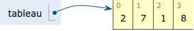
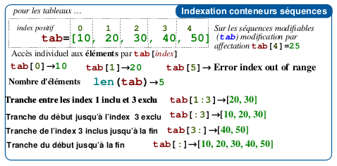
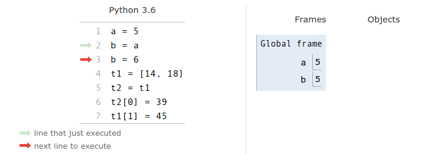
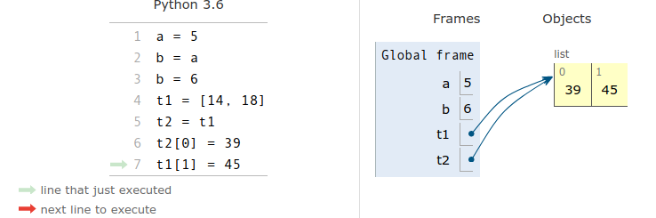
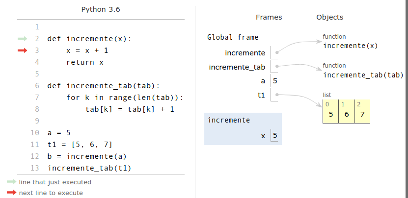
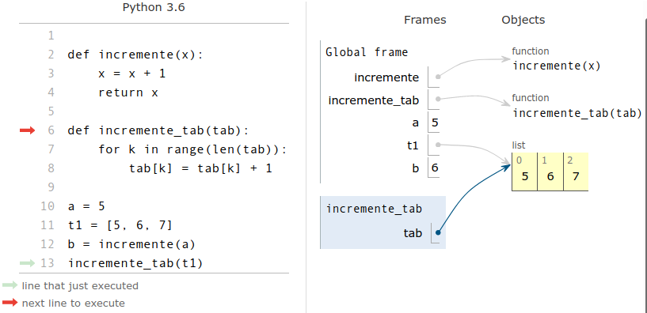
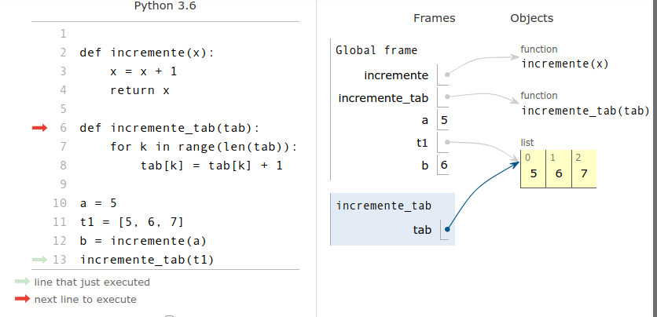

- [Crédits](#crédits)
- [Situation d’accroche](#situation-daccroche)
- [Définition d’un tableau](#définition-dun-tableau)
- [Tableaux en Python](#tableaux-en-python)
- [Accès aux éléments d’un tableau](#accès-aux-éléments-dun-tableau)
- [Construction d’un tableau](#construction-dun-tableau)
- [Opérations sur les tableaux](#opérations-sur-les-tableaux)
- [Parcours d’un tableau](#parcours-dun-tableau)
- [Aliasing](#aliasing)
  - [Aliasing et copie de tableau](#aliasing-et-copie-de-tableau)
  - [Aliasing et passage de tableau en paramètre d’une fonction](#aliasing-et-passage-de-tableau-en-paramètre-dune-fonction)
- [Méthodes de tableau dynamique en Python](#méthodes-de-tableau-dynamique-en-python)
      fonction](#aliasing-et-passage-de-tableau-en-paramètre-dune-fonction)
- [Méthodes de tableau dynamique en
  Python](#méthodes-de-tableau-dynamique-en-python)

<!-- Définition des hyperliens  -->

# Crédits

*Ce cours est largement inspiré des chapitres 5 et 8 du manuel NSI de la
collection Tortue chez Ellipse, auteurs : Ballabonski, Conchon,
Filliatre, N’Guyen. Le prepabac Première NSI de Guillaume Connan chez
Hatier a également été consulté.*

<!-- Définition des hyperliens  -->

# Situation d’accroche

**Exercice 1**

1.  Écrire une fonction `moyenne3notes(a, b, c)` qui renvoie la moyenne
    arithmétique d’une série de 3 notes `a, b, c`.
2.  Proposer une fonction `moyenne(n)` qui prend en paramètres un nombre
    de notes et retourne la moyenne de ces notes saisies par
    l’utilisateur.
3.  Quel(s) mécanisme(s) pourrai(en)t nous permettre d’écrire une
    fonction qui calcule la moyenne d’une série de notes sans
    interaction avec l’utilisateur du programme ?

# Définition d’un tableau

**Définition 1**

  - Un objet est un **conteneur** s’il peut conteneur plusieurs objets.
  - Un **conteneur** est une **séquence** s’il contient une **collection
    ordonnée** d’objets qui sont accessibles par leur **index** dans la
    séquence.
  - Un **tableau** est une structure de données qui est un **conteneur**
    et une **séquence**. Il permet de stocker plusieurs éléments dans
    une seule variable et d’y accéder par leur **index**.

  

# Tableaux en Python

**Point de cours 1**

  - En [Python](https://docs.python.org/3/tutorial/datastructures.html),
    les tableaux sont implémentés dans le type `list` et on les nomme
    souvent listes même si les listes désignent en général une autre
    structure de données. Le type `list` est suffisamment flexible pour
    représenter la structure de données tableau et d’autres comme les
    listes, piles, files … *Dans la suite de ce cours, on désigne par
    tableaux, les objets de type `list` du langage
    [Python](https://docs.python.org/3/tutorial/datastructures.html).
    Dans les exercices, comme dans les QCM d’E3C, on rencontrera parfois
    l’appellation Python liste pour désigner la structure de données
    tableau*
  - Un tableau
    [Python](https://docs.python.org/3/tutorial/datastructures.html) est
    une expression délimitée par des crochets et les éléments dans
    l’ordre croissant des index de gauche à droite sont séparés par le
    symbole virgule `,` :

<!-- end list -->

``` python
  >>> t = [4, 20, 10] # on affecte le tableau [4, 20, 10] à t
  >>> len(t)
  3
  >>> t[0]
  4
  >>> t[len(t)-1]
  10
  >>> t[3]
  Traceback (most recent call last):
    File "<stdin>", line 1, in <module>
  IndexError: list index out of range   
  >>> t[0] = 6
  >>> t
  [6, 20, 10]
```

  - La séquence de valeurs contenue dans un tableau est indexée à partir
    de 0.
  - Le **nombre d’éléments** d’un tableau affecté à une variable `t` est
    donné par la fonction `len` avec `len(t)`. Un **tableau vide** est
    noté `[]`.
  - On accède à l’élément d’index `k` avec la syntaxe `t[k]`.
  - On peut manipuler l’élément d’index `k` comme une variable et
    modifier sa valeur par une affectation avec la syntaxe `t[k] =
    valeur`.
  - On peut considérer que l’accès et la modification d’un élément à
    partir de son index se fait en **temps constant**, car les éléments
    sont stockés de façon contigue en mémoire et l’index donne le nombre
    de décalages depuis le premier élément.
  - Un tableau est **itérable**, c’est-à-dire qu’on peut parcourir ses
    éléments avec une boucle `for`:  

<!-- end list -->

``` python
>>> for e in t:
...     print(e)
... 
4
20
10
```

  - En [Python](https://docs.python.org/3/tutorial/datastructures.html),
    les tableaux peuvent contenir des éléments de types hétérogènes mais
    nous manipulerons principalement des tableaux homogènes (types `int,
    float, string`, `bool`).
  - En [Python](https://docs.python.org/3/tutorial/datastructures.html),
    les tableaux sont **dynamiques**, leur taille peut varier.

# Accès aux éléments d’un tableau

  - Dans un tableau `tab`, chaque élément de la séquence ordonnée est
    repéré par son index `k` qui permet d’accéder à l’élément avec
    l’expression `tab[k]` ou de le modifier avec l’instruction `tab[k]
    = valeur`.
  - [Python](https://docs.python.org/3/tutorial/datastructures.html)
    permet également d’extraire un sous-tableau d’un tableau `tab` avec
    l’expression `tab[debut:fin]` qui représente la sous-séquence de
    `fin - debut` éléments, entre l’élément d’index `debut` inclus et
    l’élément d’index `fin` exclu, comme pour `range(debut, fin)`. Ce
    mécanisme de découpage en tranches est désigné par le terme de
    *slicing*.
  - [Python](https://docs.python.org/3/tutorial/datastructures.html)
    permet de repérer les éléments avec des index négatifs représentant
    le décalage par rapport à la la fin de la séquence, mais nous ne les
    utiliserons pas car ils sont source d’erreurs.

  

*Figure modifiée à partir d’une source de Louis Leskow inspirée d’un
memento de Laurent Pointal*

  - On peut tester l’appartenance d’un élément à un tableau avec
    l’opérateur `in` et sa négation `not in`. Cette opération
    s’effectue en moyenne en coût proportionnel à la taille du
    tableau.

<!-- end list -->

``` python
>>> t = list(range(6))
>>> t
[0, 1, 2, 3, 4, 5]
>>> 4 in t
True
>>> 6 in t
False
>>> 6 not in t
True
```

**Exercice 2**

1.  Soit la liste suivante : `liste_pays =
    ["France","Allemagne","Italie","Belgique"]`.

Que renvoie : `liste_pays[2]` ?

2.  Quelle est la valeur référencée par le tableau L après exécution du
    programme ci-dessous ?

<!-- end list -->

``` python
L = [731, 732, 734]
L[0], L[1] = L[1], L[0]
M = L
M[1] = 732
```

**Réponse 1 :** \[732, 731, 734\] **Réponse 2 :** \[731, 732, 734\]
**Réponse 3 :** \[732, 732, 734\]

3.  On définit : `L = [10,9,8,7,6,5,4,3,2,1]`. Quelle est la valeur de
    `L[L[3]]` ?
    
      - **Réponse 1 :** 3 **Réponse 2 :** 4
      - **Réponse 3 :** 7 **Réponse 4 :** 8

4.  Écrire une fonction `recherche(tab, element)` qui prend en paramètre
    un tableau et un élément et qui retourne `True` si `element` est
    dans `tab` et `False` sinon.

# Construction d’un tableau

Il existe plusieurs façons de définir un tableau en
[Python](https://docs.python.org/3/tutorial/datastructures.html).

  - On peut le définir en **extension** en énumérant toute la séquence :

<!-- end list -->

``` python
>>> t1 = [8, 10, 11,14]
>>> t2 = [False, True, False]
```

  

  - On peut convertir en tableau un autre objet itérable (qui peut se
    parcourir avec une boucle `for`) avec le constructeur `list`.

<!-- end list -->

``` python
>>> t11 = list(range(5))
>>> t11
[0, 1, 2, 3, 4]
>>> t12 = list('alphabet')
>>> t12
['a', 'l', 'p', 'h', 'a', 'b', 'e', 't']
>>> list(4)
Traceback (most recent call last):
  File "<stdin>", line 1, in <module>
TypeError: 'int' object is not iterable
```

  - On peut le définir en **compréhension** en générant ses éléments par
    une boucle `for` sur un itérable ( générateur d’entiers `range`,
    autre tableau …) combinée éventuellement avec un filtrage par une
    instruction conditionnelle :

<!-- end list -->

``` python
>>> t3 = [k ** 2 for k in range(6)]  #carrés des entiers entre 0 et 5
>>> t3
[0, 1, 4, 9, 16, 25]
>>> t4 = [k for k in range(len(t2)) if t2[k]]  # index des éléments de t2 de valeur True
>>> t4
[1]
```

**Exercice 3**

1.  *Auteur : Germain Becker, question n°326 Genumsi*.
    
    Quel est le tableau `t` construit par les instructions suivantes ?
    
    ``` python
    tab = [1, 2, -3, 7, 4, 10, -1, 0]
    t = [e for e in tab if e >= 0]
    ```
    
      - **Réponse 1 :** `t = [1, 2, 7, 4, 10, 0]`
      - **Réponse 2 :** `t = [e, e, e, e, e, e]`
      - **Réponse 3 :** `t = [1, 2, 7, 4, 10]`
      - **Réponse 4 :** `t = [-3, -1, 0]`

2.  Quel est le résultat de l’évaluation de l’expression Python suivante
    ? *Auteur : Eric Rougier*
    
    `[2 ** n for n in range(4)]`
    
    Réponses :
    
      - **Réponse 1 :** `[0, 2, 4, 6, 8]`
      - **Réponse 2 :** `[1, 2, 4, 8]`
      - **Réponse 3 :** `[0, 1, 4, 9]`
      - **Réponse 4 :** `[1, 2, 4, 8, 16]`

3.  Qu’affiche le programme
    [Python](https://docs.python.org/3/tutorial/datastructures.html)
    ci-dessous ?

<!-- end list -->

``` python
L=[0,1,2]
M=[3,4,5]
N=[L[i]+M[i] for i in range(len(L))]
print(N)
```

4.  On exécute le script suivant :
    
    ``` python
    L = [12,0,8,7,3,1,5,3,8]
    
    a = [elt for elt in L if elt < 4]
    ```
    
    Quelle est la valeur de `a` à la fin de son exécution ?
    
      - **Réponse 1 :** `[12,0,8]` **Réponse 2 :** `[12,0,8,7]`
      - **Réponse 3 :** `[0,3,1,3]` **Réponse 4 :** `[0,3,1]`

# Opérations sur les tableaux

  - On peut concaténer deux tableaux avec l’opérateur `+`, un nouveau
    tableau est renvoyé.

<!-- end list -->

``` python
>>> t1 = [1,2]
>>> t2 = [3,4]
>>> t3 = t1 + t2
>>> t3
[1, 2, 3, 4]
```

  - L’opérateur `*` permet d’itérer une concaténation et d’initialiser
    un tableau de taille quelconque avec une valeur par défaut.
    Attention, c’est le même élément qui est dupliqué \!

<!-- end list -->

``` python
>>> t0 = [0] * 4   #un tableau de taille 4 initialisé à 0
>>> t0
[0, 0, 0, 0]
>>> tv = [True] * 6  #un tableau de taille 6 initialisé à True
>>> tv
[True, True, True, True, True, True]
>>> from random import randint
>>> t1 = [randint(1, 6) for _ in range(5)]  #5 lancers de dé à 6 faces
>>> t1
[5, 2, 2, 5, 6]
>>> t2 = [randint(1, 6)] * 5 #5 lancers de dé à 6 faces ?
>>> t2                      #non 5 fois le même lancer
[5, 5, 5, 5, 5]
```

**Exercice 4**

1.  On exécute le script suivant :
    
    ``` python
    a = [1, 2, 3]
    b = [4, 5, 6]
    c = a + b
    ```
    
    Que contient la variable `c` à la fin de cette exécution ?
    
    Réponses :
    
      - **Réponse 1 :** `[5,7,9]` **Réponse 2 :** `[1,4,2,5,3,6]`
    
      - **Réponse 3 :** `[1,2,3,4,5,6]` **Réponse 4 :** `[1,2,3,5,7,9]`

2.  Soit la fonction `mystere` ci-dessous.
    
    Quelle est la valeur retournée par
    `mystere([831, 832, 833, 841, 842, 843])` ?
    
    ``` python
    def mystere(u):
      v = []
      n = len(u)
      for k in range(n):
        v = [u[k]]+v
      return v
    ```

# Parcours d’un tableau

Il existe deux façons de parcourir un tableau en
[Python](https://docs.python.org/3/tutorial/datastructures.html) :

1.  **Le parcours par élément**, puisqu’un tableau de type `list` est
    **itérable** en
    [Python](https://docs.python.org/3/tutorial/datastructures.html) :

<!-- end list -->

``` python
>>> t6 = [3, 1, 4]
>>> for e in t6:
...     print("valeur : ", e)
... 
valeur :  3
valeur :  1
valeur :  4
```

2.  **Le parcours par index**, permet de récupérer les indexs des
    éléments en plus de leurs valeurs :

<!-- end list -->

``` python
>>> for k in range(len(t6)):
...     print("valeur : ", t6[k], " index :", k)
... 
valeur :  3  index : 0
valeur :  1  index : 1
valeur :  4  index : 2
```

**Exercice 5**

1.  Écrire une fonction `occurences(v, t)` qui retourne le nombre
    d’occurences de la valeur `v` dans le tableau `t`.

2.  *Auteur : Nicolas Réveret, question n°379 Genumsi*
    
    On a saisi le code suivant :
    
    ``` python
    liste = [0, 1, 2, 3]
    compteur = 0
    for i in range(len(liste)-1) :
        for j in range(i,len(liste)) :
            compteur += 1
    ```
    
    Que contient la variable compteur à la fin de l’exécution de ce
    script ?

3.  Revenons sur notre situation d’accroche.

<!-- end list -->

  - Écrire une fonction `somme(tab)` qui retourne la somme des éléments
    d’un tableau de nombres `tab`.
  - Écrire une fonction `moyenne_arithmetique(tab)` qui retourne la
    moyenne arithmétique des éléments d’un tableau de nombres `tab`.

<!-- end list -->

4.  En voulant programmer une fonction qui calcule la valeur minimale
    d’un tableau d’entiers, on a écrit :
    
    ``` python
    def minimum(L):
        mini = 0
        for e in L:
            if e < mini:
                mini = e
        return mini
    ```
    
    Cette fonction a été mal programmée. Pour quel tableau ne
    donnera-t-elle pas le résultat attendu, c’est-à-dire son minimum ?
    
    Réponses :
    
      - **Réponse 1 :** `[-1,-8,12,2,23]`
      - **Réponse 2:** `[0,18,12,2,3]`
      - **Réponse 3:** `[-1,-1,12,12,23]`
      - **Réponse 4:** `[1,8,12,2,23]`

5.  Écrire une fonction `max_tab(tab)` qui retourne le maximum d’un
    tableau de nombres passé en paramètre.

# Aliasing

## Aliasing et copie de tableau

**Point de cours 2**

  - Pour les tableaux (type `list`), comme pour les autres types
    construits, le mécanisme de l’affectation de variable en
    [Python](https://docs.python.org/3/tutorial/datastructures.html)
    diffère de celui des types base : `int, float, bool`). Lors de
    l’affectation `tab = [6, 3, 1]`, la variable `tab` ne reçoit pas
    comme valeur les éléments du tableau mais une **référence** vers la
    zone mémoire où ils sont effectivement stockés. Ce mécanisme est
    désigné par le terme *d’aliasing*.

  - Illustrons ces différences en déroulant une séquence d’affectations
    avec
    [Python-tutor](http://pythontutor.com/visualize.html#mode=edit), où
    l’on copie par affectation une variable de type `int` puis une
    variable de type `list`.
    
      - **Étape 1 :** Si `a` est de type de base (ici `int`),
        l’affectation `b = a` assigne à la variable `b` une copie de
        la valeur de la variable `a` (ici 50.)
    
      
    
      - **Étape 2 :** Si on modifie la valeur de `b`, la variable `a`
        n’est pas touchée, les deux variables sont indépendantes.
    
      
    
      - **Étape 3 :** Si on affecte le tableau `[14, 18]` à la variable
        `t1`, celle-ci ne prend pas pour valeur directement la séquence
        d’éléments du tableau mais une **référence** vers cette
        séquence.
    
      
    
      - **Étape 4 :** Si `t1` est de type construit (ici `list`),
        l’affectation `t2 = t1` assigne à la variable `t2` une copie
        de la valeur de la variable `t1` comme pour les types de base,
        sauf que la valeur de `t1` est une **référence**. On dit que
        `t1` et `t2` partagent la même référence.
        
          
    
      - **Étape 5 :** Comme `t1` et `t2` partagent la même référence,
        toute modification de `t1` touche `t2` et vice-versa. On parle
        **d’effet de bord**. Attention, il faut bien comprendre ce
        mécanisme pour éviter les effets de bord indésirables \!
        
          
        
          

  - On peut réaliser une **copie superficielle** (ou *shallow copy*)
    d’un tableau ou d’une variable de type construit avec le mécanisme
    de *slicing*. Noys y reviendrons plus tard, pour les structures
    imbriquées (tableaux de tableaux), il faudra copier récursivement
    les valeurs correspondant à toutes les références avec une **copie
    profonde**. Le module `copy` propose une fonction `copy` pour la
    copy superficielle et une fonction `deepcopy` pour la copie
    profonde.
    
      

**Exercice 6**

1.  Écrire une fonction `copie(tab)` qui retourne une copie
    superficielle du tableau `tab` sans utiliser de *slicing*.

2.  *Auteur : Nicolas Revéret*
    
    On considère le code suivant :
    
    ``` python
    def f(tab):
      for i in range(len(tab)//2):
        tab[i],tab[-i-1] = tab[-i-1],tab[i]
    ```
    
    Après les lignes suivantes :
    
    ``` python
    tab = [2,3,4,5,7,8]
    f(tab)
    ```
    
    Quelle est la valeur de la variable `tab` ?
    
    Réponses :
    
      - **Réponse 1** `[2,3,4,5,7,8]` **Réponse 2** `[5,7,8,2,3,4]`
      - **Réponse 3** `[8,7,5,4,3,2]` **Réponse 4** `[4,3,2,8,7,5]`

## Aliasing et passage de tableau en paramètre d’une fonction

En [Python](https://docs.python.org/3/tutorial/datastructures.html),
lorsqu’on appelle une fonction avec des **paramètres effectifs**, les
**paramètres formels** apparaissant dans la signature de la fonction,
deviennent des variables locales à la fonction et reçoivent comme
valeurs des copies des valeurs des paramètres effectifs. Les types
construits, comme les tableaux de type `list`, ayant pour valeur une
référence, le paramètre formel va partager la même référence et on va
retrouver les mêmes effets de bord que dans la copie de tableau par
affectation.

  - **Étape 1 :** On définit une variable globale `a` de type `int`, une
    variable `t1` de type `list` (un tableau), une fonction
    `incremente(x)` qui incrémente la valeur du paramètre `x` de type
    `int` et une fonction `incremente_tab(tab)` qui incrémente tous les
    éléments du paramètre `tab`de type `list`.
    
      

  - **Étape 2 :** On appelle `incremente(a)` et on affecte la valeur
    retournée à une variable `b`. Lors de l’appel, le paramètre formel
    `x` prend pour valeur une copie de la valeur du paramètre effectif
    `a`. La fonction retourne la valeur 6 après incrémentation de la
    variable `x`, les variables globale `a` et locale `x` sont
    indépendantes. `x` disparaît dès que l’appel de fonction se
    termine.
    
      
    
      

  - **Étape 3 :** La variable globale `b` a été affectée avec 6 la
    valeur retournée par `incremente(a)`. La variable `a` n’a pas été
    modifiée par effet de bord,. Lors de l’appel `incremente_tab(t1)`,
    le paramètre formel `tab` est affecté avec une copie de la valeur du
    paramètre effectif `t1`. Ce dernier n’est pas de type de base comme
    `a`, mais de type construit `list` donc sa valeur est un référence.
    
      

  - **Étape 4 :** La variable locale `tab` et la variable globale `t1`
    partagent une même référence : la fonction `incremente_tab` peut
    modifier le tableau référencé . La fonction `incremente_tab` renvoie
    `None` même si elle ne contient pas d’instruction `return`. Après
    l’appel de fonction, la variable globale `t1` a été modifiée par
    par **effet de bord**. Une fonction qui modifie l’état de la mémoire
    du programme principale, sans renvoyer de valeur, s’appelle une
    **procédure**.
    
      
    
      
    
      

**Exercice 7**

1.  On veut écrire une procédure `echange(tab, i, j)` qui échange les
    éléments d’index `i` et `j` d’un tableau `tab`. On fournit le
    modèle ci-dessous :
    
    ``` python
    def echange(tab, i, j):
      assert 0 <= i < len(tab) and 0 <= j < len(tab), "message d'erreur"
      # à compléter
    ```
    
      - Remplacer le message d’erreur de l’assertion par un message
        pertinent.
      - Compléter la fonction.

2.  Écrire une procédure `permutation_circulaire(tab)` qui modifie la
    position des éléments du tableau `tab` par permutation circulaire de
    gauche à droite :  

<!-- end list -->

``` python
>>> t = list(range(6))
>>> t
[0, 1, 2, 3, 4, 5]
>>> permutation_circulaire(t)
>>> t
[5, 0, 1, 2, 3, 4]
>>> permutation_circulaire(t)
>>> t
[4, 5, 0, 1, 2, 3]
```

# Méthodes de tableau dynamique en Python

Les tableaux
[Python](https://docs.python.org/3/tutorial/datastructures.html) sont
dynamiques c’est-à-dire que leur taille peut évoluer. Pour un tableau
`tab`, les fonctions permettant d’ajouter ou enlever des éléments sont
des **méthodes** de l’objet `tab` qui s’utilisent avec la notation
pointée `tab.methode(parametres)`. Un tableau étant de type `list` il
est équivalent d’écrire `list.methode(tab, parametres)`.

``` python
>>> t = []   #tableau vide
>>> t.append(8)  #ajout de l'élément 8 à la fin de t
>>> t
[8]
>>> list.append(t, 7)  #ajout de l'élément 7 à la fin de t
>>> t
[8, 7]
```

  - On peut ajouter un élément à la fin d’un tableau avec la méthode
    `append`. On peut ainsi peupler un tableau initialement vide.

<!-- end list -->

``` python
>>> t5 = []
>>> for k in range(3):
...     t5 .append(k ** 2)
... 
>>> t5
[0, 1, 4]
```

  - On peut insérer un élément avec la méthode `insert` qui prend en
    paramètre l’index de l’élément une fois inséré. Les éléments à sa
    droite étant tous décalés vers la droite, l’insertion peut
    représenter un coût proportionnel à la taille du tableau si elle se
    fait au début du tableau.

<!-- end list -->

``` python
>>> t = ['a', 'c', 'd']
>>> t.insert(1, 'b')
>>> t
['a', 'b', 'c', 'd']
```

  - On peut extraire un élément de deux façons :
    
      - À partir de son index, avec la méthode `pop`, qui prend pour
        paramètre l’index de l’élément extrait, le dernier par défaut.
        Tous les éléments à droite de l’élément extrait doivent être
        décalés vers la gauche, ce qui peut représenter un coût
        proportionnel à la taille du tableau si l’extraction se fait au
        début du tableau.
    
    <!-- end list -->
    
    ``` python
    >>> carac = [chr(k) for k in range(ord('a'), ord('g'))]
    >>> carac
    ['a', 'b', 'c', 'd', 'e', 'f']
    >>> carac.pop()
    'f'
    >>> carac
    ['a', 'b', 'c', 'd', 'e']
    >>> carac.pop(0)
    'a'
    >>> carac
    ['b', 'c', 'd', 'e']
    ```
    
      - À partir de sa valeur avec la méthode `remove`, la première
        occurence trouvée de l’élément passée en paramètre est
        supprimée. Encore une fois, le coût peut être proportionnel à
        la taille du tableau si la suppression se fait au début.
    
    <!-- end list -->
    
    ``` python
    >>> t = [0,1,0,1]
    >>> t = [0,2,0,2]
    >>> t.remove(2)
    >>> t
    [0, 0, 2]
    >>> t.remove(1)
    Traceback (most recent call last):
      File "<stdin>", line 1, in <module>
    ValueError: list.remove(x): x not in list
    ```

  - On peut compter le nombre d’occurences d’un élément dans un tableau
    avec la méthode `count`.

<!-- end list -->

``` python
>>> t = [randint(1, 6) for _ in range(1_000_000)]  #10**6 lancers de dés 
>>> t.count(6)  #nombre de 6, cohérent non ?
166821
```

**Exercice 8**

1.  Écrire une fonction fonction `filtre_notes(tab)` qui extrait toutes
    les notes inférieures à 10 d’un tableau de notes entre 0 et 20 et
    les renvoie dans un autre tableau.

2.  Écrire une fonction renvoyant le maximum d’un tableau passé en
    paramètre et le tableau des positions où ce maximum est atteint.

3.  On définit en Python la fonction suivante :
    
    ``` python
    def f(L):
        S = []
        for i in range(len(L)-1):
            S.append(L[i] + L[i+1])
        return S
    ```
    
    Quel est le tableau renvoyé par `f([1, 2, 3, 4, 5, 6])` ?
    
      - **Réponse 1** `[3, 5, 7, 9, 11, 13]`
      - **Réponse 2** `[1, 3, 5, 7, 9, 11]`
      - **Réponse 3** `[3, 5, 7, 9, 11]`
      - **Réponse 4** cet appel de fonction déclenche un message
        d’erreur
