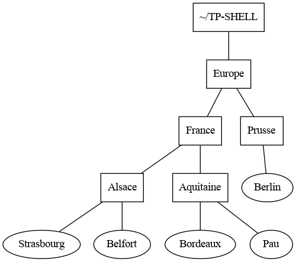

<!-- Définition des hyperliens  -->

# Crédits

*TP directement inspiré des livres Manuel de première NSI chez Ellipses
de Thibault Balabonski, [La ligne de commande par
l’exemple](https://www.eyrolles.com/Informatique/Livre/la-ligne-de-commande-par-l-exemple-9782351410721/)
de Vincent Fourmond et [Parlez-vous Shell
?](https://www.eyrolles.com/Informatique/Livre/parlez-vous-shell--9782729877590/)
de Thomas Hugel.*

Pour traiter les exercices on pourra s’aider de mementos sur les
principales commandes du *shell*
[BASH](https://fr.wikipedia.org/wiki/Bourne-Again_shell) :

  - <https://juliend.github.io/linux-cheatsheet/>
  - <https://gitlab.com/frederic-junier/nsi-public/-/blob/master/Premiere/Systeme/memento-shell/memento-shell-git.md>

# Exercices de niveau bac

**Exercice 1**

Sans toucher le clavier, décrire l’effet de chacune des commandes
suivantes, en supposant qu’elles sont enchaînées dans l’ordre :

``` shell
junier@fredportable:~$ cd ~
junier@fredportable:~$ mkdir sandbox
junier@fredportable:~$ cd sandbox/
junier@fredportable:~/sandbox$ mkdir nsi
junier@fredportable:~/sandbox$ cd nsi 
junier@fredportable:~/sandbox/nsi$ touch TP_shell
junier@fredportable:~/sandbox/nsi$ chmod ugo=rw-rw-rw- TP_shell 
junier@fredportable:~/sandbox/nsi$ cd ..
junier@fredportable:~/sandbox$ mkdir maths
junier@fredportable:~/sandbox$ mkdir maths/premiere
junier@fredportable:~/sandbox$ touch maths/TP_proba
junier@fredportable:~/sandbox$ ls maths
```

**Exercice 2**

*exercice du manuel de première NSI chez Ellipses*

Sans toucher le clavier dessiner l’arborescence du répertoire `~/test`
après l’exécution dans l’ordre de la séquence de commandes ci-dessous :

``` shell
junier@fredportable:~$ mkdir sandbox
junier@fredportable:~$ cd sandbox/
junier@fredportable:~/sandbox$ mkdir a b c d
junier@fredportable:~/sandbox$ touch a/t.txt d/foo.txt
junier@fredportable:~/sandbox$ cd c
junier@fredportable:~/sandbox/c$ mkdir ../b/e f g
junier@fredportable:~/sandbox/c$ cd ..
junier@fredportable:~/sandbox$ 
junier@fredportable:~/sandbox$ cp */*.txt c/g
junier@fredportable:~/sandbox$ rm -rf d
```

**Exercice 3**

*QCM de type E3C 2*

1.  Dans un système Linux, on dispose d’un répertoire racine contenant
    deux répertoires `documents` et `sauvegardes`. On se trouve dans le
    répertoire documents où figure un fichier `NSI.txt`.

Quelle commande permet de créer une copie nommée `NSI2.txt` de ce
fichier dans le répertoire sauvegardes ?

**Réponses**

**A)** `cp NSI.txt NSI2.txt`

**B)** `cp NSI.txt sauvegardes/NSI2.txt`

**C)** `cp NSI.txt ../NSI2.txt`

**D)** `cp NSI.txt ../sauvegardes/NSI2.txt`

2.  À partir du dossier `~/Doc/QCM`, quelle commande permet de rejoindre
    le dossier `~/Hack/Reponses` ?

***Réponses***

**A)** `cd Hack/Reponses`

**B)** `cd /Hack/Reponses`

**C)** `cd ~/Hack/Reponses`

**D)** `cd ../../Hack/Reponses`

3.  Sous Linux, les droits d’accès à un fichier dont le propriétaire est
    Joseph sont les suivants : `-rwxr-xr--`

Laquelle des affirmations suivantes est **fausse** ?

**Réponses**

**A)** Joseph a l’autorisation de lire ce fichier

**B)** les membres du groupe de Joseph ont l’autorisation de lire ce
fichier

**C)** tous les utilisateurs ont l’autorisation de lire ce fichier

**D)** les membres du groupe de Joseph ont l’autorisation de modifier ce
fichier

4.  Dans la console Linux, quelle commande faut-il exécuter pour effacer
    le fichier `test0.csv` ?

**Réponses**

**A)** `rm test0.csv`

**B)** `cp test0.csv`

**C)** `ls test0.csv`

**D)** `mv test0.csv`

5.  Dans un terminal, on exécute la suite de commandes système suivante
    :

<!-- end list -->

``` shell
cd ~
cd seances/tp
mv exercice.txt ./../../exercice.txt
```

Où se trouve finalement placé le fichier exercice.txt ?

**Réponses**

**A)** dans le répertoire `~/seance/tp`

**B)** dans le répertoire `~/seance`

**C)** dans le répertoire `~`

**D)** dans le répertoire `/home`

6.  Pour renommer un fichier `text1.txt` en `text1.old` dans un même
    répertoire, quelle commande faut-il utiliser ?

***Réponses***

**A)** mv text1.txt ../text1.old

**B)** mv text1.txt text1.old

**C)** cp text1.txt text1.old

**D)** lns text1.txt text1.old

7.  Sous Unix, que fait la commande suivante ? `ls --a /home/pi >>
    toto.txt`

***Réponses***

**A)** elle liste uniquement les répertoires cachés du répertoire
/home/pi

**B)** elle liste tous les fichiers du répertoire /home/pi et enregistre
le résultat dans un fichier toto.txt

**C)** elle liste tous les fichiers des répertoires de /home/pi et de
toto.txt

**D)** elle liste tous les fichiers du répertoire courant et enregistre
le résultat dans un fichier /home/pi/toto.txt

8.  Par quelle ligne de commande peut-on créer, sous le système
    d’exploitation Linux, trois répertoires nommés : JAVA, PYTHON et
    PHP ?

***Réponses***

**A)** `mkdir JAVA, PYTHON, PHP`

**B)** `mk -dir JAVA PYTHON PHP`

**C)** `mkdir JAVA PYTHON PHP`

**D)** `mk dir JAVA PYTHON PHP`

**Question E.6**

9.  À partir du répertoire `~/Perso/Doc` quelle commande permet de
    rejoindre le répertoire `~/Public` ?

**Réponses**

**A)** `cd ./Public`

**B)** `cd ../Public`

**C)** `cd ././Public`

**D)** `cd ../../Public`

10. Dans la console Linux, quelle commande faut-il exécuter pour obtenir
    la documentation sur la commande `pwd` ?

**Réponses**

**A)** man pwd

**B)** cd pwd

**C)** mkdir pwd

**Exercice 4**

*Exercice du livre Parlez-vous Shell ? de Thomas Hugel chez Ellipses*

  

On se place dans le répertoire personnel de l’utilisateur représenté par
le raccourci `~`.

1.  Dans son répertoire personnel, créer le répertoire ̀̀`TP-SHELL` puis
    entrer dans ce répertoire.
2.  Créer le répertoire `Europe` et changer de répertoire courant pour
    `Europe`.
3.  Écrire une suite de commandes qui permet de construire
    l’arborescence ci-dessus sans quitter le répertoire `Europe`. Les
    fichiers apparaissant avec des rectangles sont des répertoires et
    les autres sont des fichiers.
4.  Créer dans `~` une copie de tout le répertoire `Europe` avec ses
    sous-répertoires et nommer cette copie `Vieille-Europe`. Les
    modifications qui suivent devront être faites dans `Europe`.
5.  Appliquons le traité de Francfort de 1871. Se placer dans le
    répertoire `Prusse` et déplacer `Belfort` dans `France` puis
    déplacer `Alsace` dans `Prusse`. Revenir dans `Europe` et renommer
    `Prusse`en `Allemagne`.
6.  Depuis `Europe`, afficher le contenu de `Bordeaux` puis détruire ce
    fichier.
7.  Appliquons le traité de Versailles de 1919. Depuis `France`, ramener
    `Alsace` en `France` puis détruire `Vieille-Europe`.

# Exercices plus avancés

## Flux d’entrée / sortie et redirections, filtres et pipeline

  - Par défaut, chaque programme (dont les commandes *shell*) exécuté
    dans un *shell* [UNIX](https://fr.wikipedia.org/wiki/Unix) admet
    trois canaux, ou flux, de communication avec l’extérieur :
    
      - Un canal d’entrée nommé *entrée standard* (*stdin* en anglais)
        qui par défaut est le texte saisi au clavier dans le terminal.
      - Un canal de sortie nommé *sortie standard* (*stdout* en anglais)
        qui par défaut est l’écran du terminal.
      - Un canal d’erreur nommé *erreur standard* (*stderror* en
        anglais) qui par défaut est l’écran du terminal.

  - On peut modifier l’entrée ou la sortie standard d’une comande pour
    lire ou écrire sur d’autres canaux que ceux par défaut (fichiers ou
    flux réseaux au lieu de clavier / écran ). Pour rediriger un flux
    vers l’entrée ou la sortie standard d’une commande on utilise des
    *opérateurs de redirection* :

| Opérateur | Redirection                       |
| --------- | --------------------------------- |
| \>        | sortie standard                   |
| \>\>      | sortie standard en ajout à la fin |
| \<        | entrée standard                   |

  - Par exemple, si on veut écrire le contenu du répertoire courant dans
    un fichier `contenu.txt`, on redirige la sortie standard de `ls`
    vers un fichier `contenu.txt` au lieu de l’écran du terminal :
    
    ``` 
        junier@fredportable:~$ ls > contenu.txt
    ```

  - Et si on veut compter le nombre de mots dans un texte, on redirige
    son entrée standard vers le contenu de `texte.txt` au lieu du
    clavier :
    
    ``` 
       junier@fredportable:~$ wc -m < texte.txt 
    ```

  - On peut enchaîner les commandes en *pipeline* : la sortie standard
    d’une commande est raccordée à l’entrée standard d’une commande
    suivante à l’aide d’un *pip* symbolisé par le caractère `|` :
    
    ``` 
          commande_debut | commande_fin
    ```

  - Si on veut intercaler une commande entre les deux, elle doit envoyer
    son entrée standard sur sa sortie standard : de telles commandes qui
    servent de traitements intermédiaires entre le début et la fin d’un
    pipeline sont appelées *filtres*. On peut ainsi réaliser en un une
    ligne de commande des traitements complexes.
    
    ``` 
          commande_debut | filtre1 | filtre2 | ... | commande_fin
    ```

  - Le tableau ci-dessous donne quelques exemples de filtres, d’autres
    options sont disponibles pour chaque commande.

| Commande      | Action                                                                                           |
| ------------- | ------------------------------------------------------------------------------------------------ |
| cat           | copie son entrée standard sur sa sortie standard sans modification                               |
| sort          | trie les lignes de son entrée standard par ordre alphabétique                                    |
| sort -r       | trie les lignes de son entrée standard par ordre alphabétique inverse                            |
| sort -n       | trie les lignes de son entrée standard par ordre numérique                                       |
| cut -d : -f 5 | sélectionne le 5 eme champ de chaque ligne de son entrée standard découpée selon le délimiteur : |
| wc -l         | compte les lignes de son entrée standard                                                         |
| wc -w         | compte les mots de son entrée standard                                                           |
| wc -m         | compte les caractères de son entrée standard                                                     |
| uniq          | supprime les lignes considérées comme des doublons                                               |
| head -n5      | affiche les cinq premières lignes de son entrée standard                                         |
| head -n-5     | affiche tout sauf les cinq dernières lignes de son entrée standard                               |
| tail -n5      | affiche les cinq dernières lignes de son entrée standard                                         |
| tail -n+5     | affiche tout sauf les cinq premières lignes de son entrée standard                               |

  

**Exercice 5**

*Exercice du manuel de première NSI de Thibault Balabonski chez
Ellipses*

Le fichier `/etc/passwd` contient la liste des utilisateurs locaux de la
machine. Pour chaque question, on recherchera éventuellement dans le
manuel avec la commande `man command` les options pertinentes des
commandes proposées.

1.  Afficher les 5 premières lignes du fichier `/etc/passwd`.
2.  Afficher la page du manuel de la commande `tac` puis utiliser cette
    commande pour afficher `tac` à l’envers.
3.  Trier le fichier `/etc/passwd` avec la commande `sort`. Quel ordre
    est utilisé ?
4.  Les champs de chaque ligne de `/etc/passwd` sont séparées par le
    caractère `:`. Trier le fichier selon le troisième champ. Quel ordre
    est utilisé ?
5.  Trier `/etc/passwd` selon le troisième champ avec l’ordre numérique.

**Exercice 6**

1.  Ouvrir un terminal *shell* et choisir comme répertoire courant
    ̀`~/TP-SHELL`.

2.  Créer un un répertoire `carnet` puis entrer dans ce répertoire.

3.  Consulter l’aide de la commande `wget` avec `wget --help` ou `man
    wget` puis télécharger le fichier
    d’[URL](https://fr.wikipedia.org/wiki/Uniform_Resource_Locator) :
    <https://gitlab.com/frederic-junier/nsi-public/-/raw/master/Premiere/Systeme/TP2/contacts-1000.csv>

4.  Afficher les 3 premières lignes de `contacts-1000.csv`, puis ses 3
    dernières lignes puis son nombre de lignes. Chaque ligne contient un
    nom de contact et une adresse mail séparés par le caractère `,`.

5.  Écrire une commande qui affiche les 10 premières lignes du contenu
    de `contacts-1000.csv` classé par ordre alphabétique croissant.

6.  Écrire une commande qui trie `contacts-1000.csv` par ordre
    alphabétique croissant puis recopie ce contenu dans le fichier
    `contacts-1000-alpha.csv`.

7.  Écrire une commande qui filtre les lignes de `contacts-1000.csv` en
    sélectionnant uniquement le champ nom puis qui classe ces noms par
    ordre alphabétique croissant.

8.  Compléter la commande précédente pour qu’elle supprime les doublons
    et affiche devant chaque nom le nombre de doublons, c’est-à-dire
    d’adresses mails du contact. On consultera la page de manuel de la
    commande `uniq` pour sélectionner la bonne option.

9.  Modifier la commande précédente pour que les contacts soient classés
    par nombre décroissant d’adresses mails et que le tout soit redirigé
    vers un fichier `top-mails.txt`.

## Recherches

Le *shell* [BASH](https://fr.wikipedia.org/wiki/Bourne-Again_shell)
fournit de nombreuses commandes pour rechercher des informations dans le
système de fichiers.

  - Pour une recherche sur les fichiers, on peut utiliser la commande
    `find` qui permet d’effectuer une recherche par nom parmi de
    nombreuses options :

| Commande                        | Action                                                                                                              |
| ------------------------------- | ------------------------------------------------------------------------------------------------------------------- |
| find -name photo.png            | recherche les fichiers nommés photo.png dans le répertoire courant et tous ses sous-répertoires                     |
| find -iname photo.png           | idem mais insensible à la casse                                                                                     |
| find -name photo.png \~/sandbox | recherche les fichiers nommés photo.png dans le répertoire \~/sandbox et tous ses sous-répertoires                  |
| find -name ’\*.png’ \~/sandbox  | recherche les fichiers dont le nom se termine par `.png` dans le répertoire \~/sandbox et tous ses sous-répertoires |

  - Par exemple, si on veut rechercher le fichier
    ‘ducotedechezswann.txt’ dans son répertoire personnel :
    
    ``` 
        junier@fredportable:~$ find -name 'ducotedechezswann.txt' 
        ./Git/Gitlab/frederic-junier/Premiere-NSI/ducotedechezswann.txt
        ./NSI/TP/ressources/ducotedechezswann.txt
    ```

  - Pour une recherche sur un contenu de fichier, on peut utiliser la
    commande `grep` qui permet d’effectuer une recherche d’un fragment
    de texte dans les fichiers donnés en argument. Par défaut `grep`
    affiche chaque ligne de fichier où le fragment apparaît.

| Commande                           | Action                                                                                           |
| ---------------------------------- | ------------------------------------------------------------------------------------------------ |
| grep ‘fragment texte’ fichier      | recherche les occurences de ‘fragment texte’ dans fichier                                        |
| grep -c ‘fragment texte’ fichier   | affiche juste le nombre d’occurences de ‘fragment texte’ dans fichier                            |
| grep -r ‘fragment texte’ rep       | recherche les occurences de ‘fragment texte’ dans le répertoire rep et tous ses sous-répertoires |
| grep -r -l -i ‘fragment texte’ rep | idem mais n’affiche que les noms de fichiers et insensible à la casse                            |

  - Par exemple si on veut compter le nombre d’occurences de ‘swann’
    dans le texte ‘unamourdeswann.txt’ :
    
    ``` 
        junier@fredportable:~$ grep -i -c 'swann' ducotedechezswann.txt
        685
    ```

**Exercice 7**

Ouvrir un terminal avec la page de manuel de la commande `find` obtenue
avec `man find`.

Ouvrir un autre terminal pour traiter les questions suivantes.

1.  Écrire une commande qui affiche tous les fichiers d’extension `.py`
    contenus dans son répertoire personnel ou ses sous répertoires.

2.  Compléter la commande précédente pour afficher le nombre des
    fichiers trouvés.

3.  Compter de même le nombre de fichiers d’extension `.py` dans le
    répertoire `/usr/share`.

4.  Écrire une commande qui compte le nombre total de répertoires
    contenus dans son répertoire personnel `~` et tous ses
    sous-répertoires.

5.  Écrire une commande qui compte le nombre de fichiers qui ne sont pas
    des répertoires et qui ont été créés dans son répertoire personnel
    et tous ses sous-répertories dans les dix dernières minutes.

**Exercice 8**

Le projet Gutenberg met à disposition des utilisateurs des textes du
domaine public en format numérique (`txt`, `epub` …) sous licence libre
(voir [The Gutenberg
License](https://www.gutenberg.org/wiki/Gutenberg:The_Project_Gutenberg_License)).

Le texte brut du “Tour du monde en 80 jours” écrit par Jules Verne est
disponible à partir de
l’[URL](https://fr.wikipedia.org/wiki/Uniform_Resource_Locator)
<http://www.gutenberg.org/ebooks/800.txt.utf-8>.

1.  Ouvrir un terminal *shell* et choisir comme répertoire courant
    `~/TP-SHELL`.

2.  Créer un un répertoire `Phileas` puis entrer dans ce répertoire.

3.  Consulter l’aide de la commande `wget` avec `wget --help` ou `man
    wget` puis télécharger le fichier contenant le texte du “Tour du
    monde en 80 jours” au format `txt`.
    
    ``` 
     junier@fredportable:~/TP-SHELL/Phileas$ ls
     800.txt.utf-8
    ```

4.  Renommer le fichier en `tour-du-monde-80-jours.txt`.
    
    ``` 
     junier@fredportable:~/TP-SHELL/Phileas$ ls
     tour-du-monde-80-jours.txt
    ```

5.  Afficher le nombre de lignes, le nombre de mots, le nombre de
    caractères et le nombre d’octets de `tour-du-monde-80-jours.txt`
    avec des options bien choisies de la commande `wc`. Comment peut-on
    expliquer que le nombre de caractères est inférieur au nombre
    d’octets ? Vérifier l’encodage du fichier avec la commande `file
    tour-du-monde-80-jours.txt`.

6.  Les commandes `du` et `zip` permettent respectivement d’afficher la
    taille d’un fichier et de compresser un fichier. Consulter leurs
    pages de manuel avec `man du | less` et `man zip | less`. La
    commande `less` est un *pager* qui permet d’afficher une page à la
    fois dans le terminal.

<!-- end list -->

  - Afficher la taille du fichier en kilo-octets avec la commande `du -h
    tour-du-monde-80-jours.txt`.
  - Compresser la fichier avec la commande `zip`. Quel est le taux de
    compression ?
  - Avec la commande `head`, afficher les dix premières lignes des
    fichiers `tour-du-monde-80-jours.txt` et
    `tour-du-monde-80-jours.zip`. Que peut-on remarquer ?

<!-- end list -->

7.  Consulter la page de manuel de la commande `tac` avec `man | less
    tac`. En une seule commande, créer un fichier
    `tour-du-monde-80-jours-inverse.txt` où toutes les lignes du fichier
    initial sont recopiées à l’envers.
8.  Dans `tour-du-monde-80-jours.txt`, avec la commande `grep` et des
    options bien choisies :

<!-- end list -->

  - Compter le nombre d’occurences du mot `phileas`. On doit trouver
    330.
  - Afficher le numéro de ligne du fragment de texte “\*\*\* START OF”.
    Vérifier avec un éditeur de textes.
  - Afficher le numéro de ligne du fragment de texte “\*\*\* END OF”.
    Vérifier avec un éditeur de textes.
  - En une seule commande, créer un fichier texte
    `tour-du-monde-80-jours-brut.txt` qui contient toutes les lignes
    comprises entre celles commençant par `*** START OF` et `*** END
    OF`, les deux bornes exclues.
