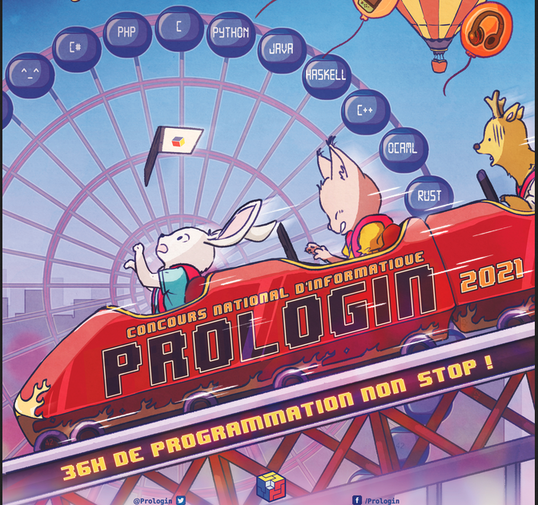

## Python 

### Installation de Python

- [Installation standard avec Idle](https://www.python.org/downloads/)
- [Installation Anaconda + Pyzo](https://pyzo.org/start.html)
- [Installation Thonny (debugger très pratique)](https://thonny.org/)

### Tutoriels

* Memento / Cheatsheet :
  * [Memento de Laurent Pointal](https://perso.limsi.fr/pointal/_media/python:cours:mementopython3.pdf)
  
### Interpréteurs en ligne 

- [repl.it](https://repl.it/languages/python3)
- [Pythontutor](http://pythontutor.com/)  : permet de visualiser l'évolution des variables
- [basthon (Romain Casati)](https://frederic-junier.org/basthon/) => très bien car on peut téléverser un script, télécharger ou partager en lien et sans créer de compte !
- [basthon version notebook](https://notebook.basthon.fr/) => comme basthon mais pour les notebook jupyter !

### Jupyter Hub

Pour accéder aux Notebook Jupyter (fichiers d'extension ipynb dans les dossiers ressources ou corrige) du dépôt en mode interactif, cliquez sur le lien Binder ci-dessous.

## Éditeurs de textes 

Il est indispensable d'installer un éditeur de textes sur sa plateforme, pour éditer des fichier sources en Python, Javascript ou HTML.

* Un éditeur multiplateformes : [Notepad++](https://notepad-plus-plus.org/)
* Un éditeur pour le développement Web : [Brackets](http://brackets.io/)

## Plateformes d'entraînement 

* [France IOI](http://www.france-ioi.org/) : l'inscription est fortement recommandée, nous avons créé un groupe ParcPremiereNSI.
   <iframe width="300" height="169" sandbox="allow-same-origin allow-scripts allow-popups" src="presentation-franceioi.mp4" frameborder="0" allowfullscreen></iframe>

* Pour s'entraîner sur les constructions élémentaires (boucles, tests, variables, procédures, listes), France IOI propose désormais un parcours en ligne avec le module `turtle`  : <http://www.france-ioi.org/progresser/>

* [Codin Game](https://www.codingame.com) : l'inscription est libre, une orientation plus ludique mais attention ce  site comporte des publicités.
* Le site de préparation du  concours [Prologin](https://prologin.org/) destiné initialement plutôt à des étudiants en première ou deuxième année postbac, mais c'était avant l'ouverture de la spécialité NSI ... 
    
